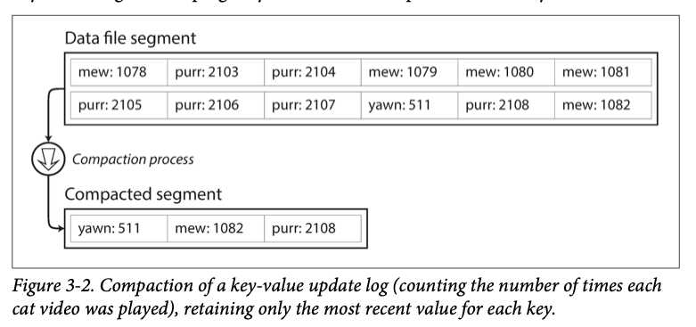
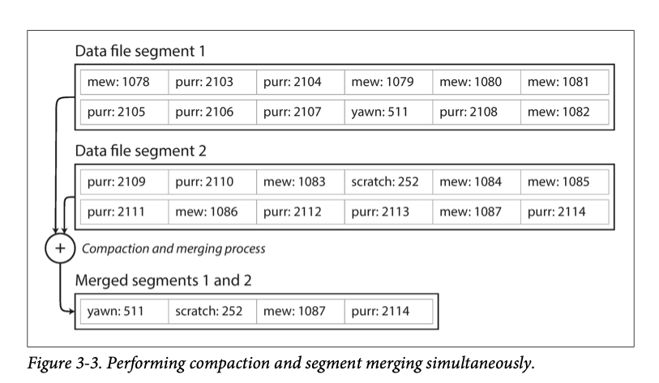
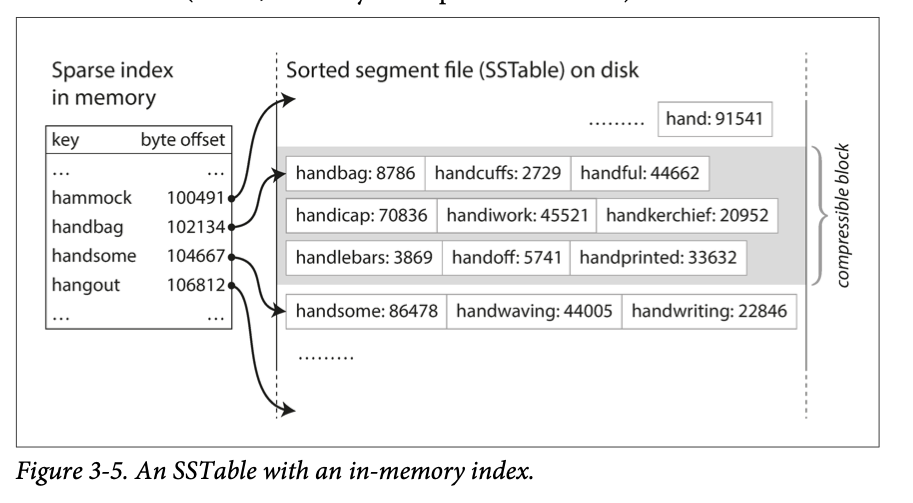
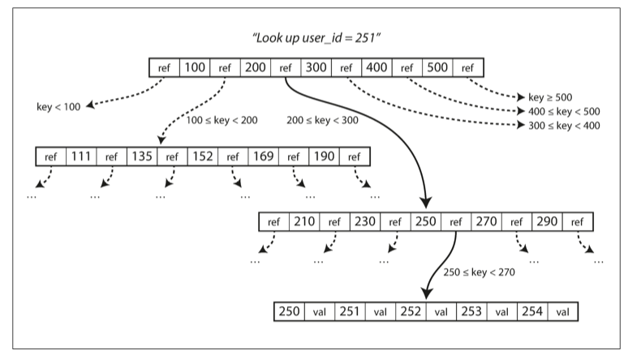
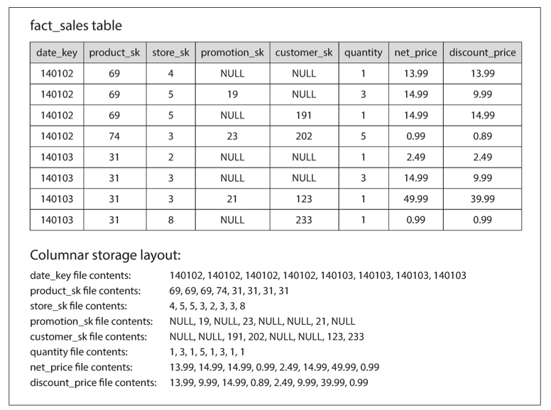
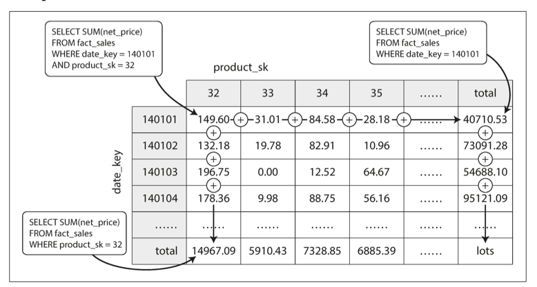

# Design Data Intensive Application

## Chapter 1 Reliable, Scalable, and Maintainable Applications

---

### Scalable

Metrics:

Latency vs Response time

- Latency: Amount of the time to take for a request to be processed
- Response time: How long the use have to wait to see the response

Measurement metric using Median or percentiles make more sense and *tail latencies* (high percentile ~99%) is important because they directly affect user experience.

**head-of-line blocking: t**ake measurement on client side is critical due to there are always some limitations on server side and a couple of  slow requests can quickly starving the following request even though those starving request can be handled quickly. While doing stress test, send request to server independently of response time

combine with above. Even if only a small percentage of backend calls are slow, the chance of getting a slow call increases if an end-user request requires multiple back‐ end calls, and so a higher proportion of end-user requests end up being slow (an effect known as **tail latency amplification**

Approaches for Coping with Load

> An architecture that is appropriate for one level of load is unlikely to cope with 10 times that load. If you are working on a fast-growing service, it is therefore likely that you will need to rethink your architecture on every order of magnitude load increase —or perhaps even more often than that.

Approaches: vertical scaling, horizontal scaling, and elastic.

Decision making factors are numerous: the volume of reads, the volume of writes, the volume of data to store, the complexity of the data, the response time requirements, the access patterns, or (usually) some mixture of all of these plus many more issues.

### Maintainability

Three golden rules:

- Operability
Make it easy for operations teams to keep the system running smoothly.
- Simplicity
Make it easy for new engineers to understand the system, by removing as much complexity as possible from the system.
- Evolvability
Make it easy for engineers to make changes to the system in the future, adapting it for unanticipated use cases as requirements change

Operability:

team responsibilities

- Monitoring the health of the system and quickly restoring service if it goes into a bad state
- Tracking down the cause of problems, such as system failures or degraded performance
- Keeping software and platforms up to date, including security patches
- Keeping tabs on how different systems affect each other, so that a problematic change can be avoided before it causes damage
- Anticipating future problems and solving them before they occur (e.g., capacity planning)
- Establishing good practices and tools for deployment, configuration management, and more
- Performing complex maintenance tasks, such as moving an application from one platform to another
- Maintaining the security of the system as configuration changes are made
- Defining processes that make operations predictable and help keep the production environment stable
- Preserving the organization’s knowledge about the system, even as individual people come and go

solutions:

- Providing visibility into the runtime behavior and internals of the system, with good monitoring
- Providing good support for automation and integration with standard tools
- Avoiding dependency on individual machines (allowing machines to be taken down for maintenance while the system as a whole continues running uninterrupted)
- Providing good documentation and an easy-to-understand operational model (“If I do X, Y will happen”)
- Providing good default behavior, but also giving administrators the freedom to override defaults when needed
- Self-healing where appropriate, but also giving administrators manual control over the system state when needed
- Exhibiting predictable behavior, minimizing surprises

Simplicity

> various possible symptoms of complexity: explosion of the state space, tight coupling of modules, tangled dependencies, inconsistent naming and terminology, hacks aimed at solving performance problems, special-casing to work around issues elsewhere, and many more.

solution: abstraction

Evolvability

**Agile** working patterns provide a framework for adapting to change. The Agile community has also developed technical tools and patterns that are helpful when developing software in a frequently changing environment, such as test-driven development (TDD) and refactoring.

Simplicity bring agility of the data system.

## Chapter 2 Data Models and Query Languages

---

Data models are perhaps **the most important part** of developing software.

Most applications are built by layering one data model on top of another.

1. As an application developer, you look at the real world (in which there are people, organizations, goods, actions, money flows, sensors, etc.) and model it in terms of objects or data structures, and APIs that manipulate those data structures (or  API over API). Those structures are often specific to your application.
2. When you want to store those data structures, you express them in terms of a general purpose data model, such as JSON or XML documents, tables in a relational database, or a graph model.
3. The engineers who built your database software decided on a way of representing that JSON/XML/relational/graph data in terms of bytes in memory, on disk, or on a network. The representation may allow the data to be queried, searched, manipulated, and processed in various ways.
4. On yet lower levels, hardware engineers have figured out how to represent bytes in terms of electrical currents, pulses of light, magnetic fields, and more.

### Relational Model Versus Document Model

One-to-Many relationship

impedance mismatch: 

awkward translation layer is required between the objects in the application code and the database model of tables, rows, and columns. Some Object-relational mapping framework like *ActiveRecord* and *Hibernate* ease the pain a little bit but you might still need to write some `adepter` in your code.

when we try to store some on-to-many relationship in traditional database, we generally need to use one of the following solutions:

- separate table with foreign key
- SQL with XML data support
- encode data into JSON/XML store as `text`. (will make the field unsearchable)

one-to-many relations (tree structured data) are naturally suitable for JSON: lack of schema, also with better locality.

Many-to-One and Many-to-Many relationships

Storing text or ids?

Pros of storing ids:

- Consistent style and spelling across profiles
- Avoiding ambiguity (e.g., if there are several cities with the same name)
- Ease of updating—the name is stored in only one place, so it is easy to update across the board if it ever needs to be changed (e.g., change of a city name due to political events)
- Localization support—when the site is translated into other languages, the standardized lists can be localized, so the region and industry can be displayed in the viewer’s language
- Better search—e.g., a search for philanthropists in the state of Washington can match this profile, because the list of regions can encode the fact that Seattle is in Washington (which is not apparent from the string "Greater Seattle Area")
- Anything that is meaningful to humans may need to change sometime in the future—and if that information is duplicated, all the redundant copies need to be updated. That incurs write overheads, and risks inconsistencies (where some copies of the information are updated but others aren’t). Removing such duplication is the key idea behind **normalization** in databases

Unfortunately, normalizing this data requires many-to-one relationships but document based database's support for joins is often weak, the work of making the join is shifted from the database to the application code.

Back in the old days, two ways to tackle many-to-many relationships: 

- relational database (access path handled by query optimizer)
- network database model (access path handled by programmer)

Nowadays, NoSQL handle this by using same unique identifier as foreign key in RDB, which is called *[document reference](https://docs.mongodb.com/manual/tutorial/model-referenced-one-to-many-relationships-between-documents/index.html)* and issue a second query during resolving the reference.

### RDB vs Document based DB nowadays

Schema flexibility in the document model

If the data in your application has a document-like structure (i.e., a tree of one-to-many relationships, where typically the entire tree is loaded at once), then it’s probably a good idea to use a document model. The relational technique of *shredding* (splitting a document-like structure into multiple tables) can lead to cumbersome schemas and unnecessarily complicated application code.

However, if your application does use many-to-many relationships, the document model becomes less appealing. It’s possible to reduce the need for joins by denormalizing, but then the application code needs to do additional work to keep the denormalized data consistent. Joins can be emulated in application code by making multiple requests to the database, but that also moves complexity into the application and is usually slower than a join performed by specialized code inside the database. In such cases, using a document model can lead to significantly more complex application code and worse performance

Document-Based (schemaless) more like dynamic typing while RDB more like static typing. NoSQL is schemaless by definition but more suitable to call them schema-on-read because we are expecting a schema while reading from the database.

Data migration
[gh-ost: GitHub’s online schema migration tool for MySQL](https://github.blog/2016-08-01-gh-ost-github-s-online-migration-tool-for-mysql/)

The schema-on-read approach is advantageous if the items in the collection don’t all have the same structure for some reason (i.e., the data is heterogeneous)—for example, because:

- There are many different types of objects, and it is not practical to put each type of object in its own table.
- The structure of the data is determined by external systems over which you have no control and which may change at any time.

In situations like these, a schema may hurt more than it helps, and schemaless documents can be a much more natural data model. But in cases where all records are expected to have the same structure, schemas are a useful mechanism for documenting and enforcing that structure.

Data locality for queries

Storage locality is double edge blade for document-base database: need to load the entire document even if only a small portion of it is needed. On update, the entire document might be overwritten if the modification change the encoded size of the document [[reference]](https://www.mongodb.com/blog/post/schema-design-for-time-series-data-in-mongodb). Locality also is not just limited to document based database, Google Spanner DB, Oracle *multi-table index cluster tables,* and *Column-family* in Cassandra

Database has the trend of convergence of document and relational database. RDB supports JSON/XML and document-based DB support client-side join (MongoDB)

Query Language for Data

Compared to imperative query language (for-loop like, have to specify the order of the execution), SQL query language is declarative and follows the relational algebra, which just specify the pattern of the data and up to the query optimizer to handle the implementation details. The limited functionality of declarative language provide more room of optimization for the database itself. It's more like dynamically change the style of a component using CSS (browser autodetect changes and render) or JavaScript (hard to read/write, browser might not be compatible). 

Graph Database Model

## Chapter 3 Storage and Retrieval

---

### Data Structures That Power Your Database

Hash Index

Used by storage engine Bitcask.

Store an in-memory hashmap where the value is the byte offset for the content. In the worst case, retrieving a content takes 1 disk seek or 0 if the file is already in the filesystem cache. Since the hashmap in memory, generally read/write are really fast.

Pros:

suitable when value for each key is updated frequently, like view count for a url where keys are not updated frequently compared to its value.

As described so far, we only ever append to a file—so how do we avoid eventually running out of disk space? A good solution is to break the log into segments of a certain size by closing a segment file when it reaches a certain size, and making subsequent writes to a new segment file. We can then perform *compaction* on these segments, as illustrated in Figure 3-2. Compaction means throwing away duplicate keys in the log, and keeping only the most recent update for each key.

Moreover, since compaction often makes segments much smaller (assuming that a key is overwritten several times on average within one segment), we can also merge several segments together at the same time as performing the compaction. Segments are never modified after they have been written, so the merged segment is written to a new file. The merging and compaction of frozen segments can be done in a background thread, and while it is going on, we can still continue to serve read and write requests as normal, using the old segment files. After the merging process is complete, we switch read requests to using the new merged segment instead of the old segments—and then the old segment files can simply be deleted.

Each segment now has its own in-memory hash table, mapping keys to file offsets. In order to find the value for a key, we first check the most recent segment’s hash map; if the key is not present we check the second-most-recent segment, and so on. The merging process keeps the number of segments small, so lookups don’t need to check many hash maps.\

Some implementation issues

*File format*

CSV is not the best format for a log. It’s faster and simpler to use a binary format that first encodes the length of a string in bytes, followed by the raw string.

*Deleting records*

If you want to delete a key and its associated value, you have to append a special deletion record to the data file (sometimes called a *tombstone*). When log segments are merged, the tombstone tells the merging process to discard any previous values for the deleted key.

*Crash recovery*

If the database is restarted, the in-memory hash maps are lost. In principle, you can restore each segment’s hash map by reading the entire segment file from beginning to end and noting the offset of the most recent value for every key as
you go along. However, that might take a long time if the segment files are large, which would make server restarts painful. Bitcask speeds up recovery by storing a snapshot of each segment’s hash map on disk, which can be loaded into memory more quickly.

*Partially written records*

The database may crash at any time, including halfway through appending a record to the log. Bitcask files include checksums, allowing such corrupted parts of the log to be detected and ignored.

*Concurrency control*

As writes are appended to the log in a strictly sequential order, a common implementation choice is to have only one writer thread. Data file segments are append-only and otherwise immutable, so they can be read concurrently by multiple threads.

Limitations: 

- The hash table must fit in memory, so if you have a very large number of keys, you’re out of luck. In principle, you could maintain a hash map on disk, but unfortunately it is difficult to make an on-disk hash map perform well. It requires a lot of random access I/O, it is expensive to grow when it becomes full, and hash collisions require fiddly logic.
- Range queries are not efficient. For example, you cannot easily scan over all keys between two values—you’d have to look up each key individually in the hash maps.

All of above are exactly the underline implementation of ElasticSearch!

**Why append-only log ?** 

- Appending and segment merging are sequential write operations, which are generally much faster than random writes, especially on magnetic spinning-disk hard drives. To some extent sequential writes are also preferable on flash-based
*solid state drives* (SSDs).
- Concurrency and crash recovery are much simpler if segment files are append-only or immutable. For example, you don’t have to worry about the case where a crash happened while a value was being overwritten, leaving you with a file containing part of the old and part of the new value spliced together.
- Merging old segments avoids the problem of data files getting fragmented overtime. [Defragmentation](https://en.wikipedia.org/wiki/Defragmentation)

### SSTables and LSM-Trees

SSTable (Cassandra / LevelDB)

Sorted String Table: require that the sequence of key-value pairs is sorted by key

SSTable pros over log segment with hash indexes:

1. Merging segments is simple and efficient, even if the files are bigger than the available memory. The approach is like the one used in the mergesort algorithm. What if the same key appears in several input segments? Remember that each segment contains all the values written to the database during some period of time. This means that all the values in one input segment must be more recent than all the values in the other segment (assuming that we always merge adjacent segments). When multiple segments contain the same key, we can keep the value from the most recent segment and discard the values in older segments
2. In order to find a particular key in the file, you no longer need to keep an index of all the keys in memory. For an example: say you’re looking for the key `handiwork`, but you don’t know the exact offset of that key in the segment file. However, you do know the offsets for the keys `handbag` and `handsome`, and because of the sorting you know that `handiwork` must appear between those two. This means you can jump to the offset for `handbag` and scan from there until you find handiwork (or not, if the key is not present in the file). You still need an in-memory index to tell you the offsets for some of the keys, but it can be sparse: one key for every few kilobytes of segment file is sufficient, because a few kilobytes can be scanned very quickly.

    

3. Since read requests need to scan over several key-value pairs in the requested range anyway, it is possible to group those records into a block and compress it before writing it to disk (indicated by the shaded area in above figure). Each entry of the sparse in-memory index then points at the start of a compressed block. Besides saving disk space, compression also reduces the I/O bandwidth use.

How do we construct and maintain the SSTables

1. Maintained a sorted structure in memory. There are plenty of well-known tree data structures that you can use, such as red-black trees or AVL trees. With these data structures, you can insert keys in any order and read them back in sorted order. When a write comes in, add it to an in-memory balanced tree data structure (for example, a red-black tree). This in-memory tree is sometimes called a *memtable*.
2. When the memtable gets bigger than some threshold—typically a few megabytes —write it out to disk as an SSTable file. This can be done efficiently because the tree already maintains the key-value pairs sorted by key. The new SSTable file becomes the most recent segment of the database. While the SSTable is being written out to disk, writes can continue to a new memtable instance.
3. In order to serve a read request, first try to find the key in the memtable, then in the most recent on-disk segment, then in the next-older segment, etc.
4. From time to time, run a merging and compaction process in the background to combine segment files and to discard overwritten or deleted values.
5. To prevent problem when the database crush during a disk flushing, keep a separate log on disk to which every write is immediately appended, just like in the previous section. That log is not in sorted order, but that doesn’t matter, because its only purpose is to restore the memtable after a crash. Every time the memtable is written out to an SSTable, the corresponding log can be discarded.

[Google LevelDB blog](https://www.igvita.com/2012/02/06/sstable-and-log-structured-storage-leveldb/) to get a better understanding of SSTable and LSM-Tree
[Google blog about I/O](https://www.igvita.com/2009/06/23/measuring-optimizing-io-performance/) performance also worth a read
[Google Bigtable](https://research.google/pubs/pub27898/) Paper - the mother of SSTable and LSM-Tree

Lucene, an indexing engine for full-text search used by Elasticsearch and Solr, uses a similar method for storing its *term dictionary*. A full-text index is much more complex than a key-value index but is based on a similar idea: given a word in a search query, find all the documents (web pages, product descriptions, etc.) that mention the word. This is implemented with a key-value structure where the key is a word (a term) and the value is the list of IDs of all the documents that contain the word (the postings list). In Lucene, this mapping from term to postings list is kept in SSTable-like sorted files, which are merged in the background as needed

Some limitations & optimization:

1. limitation: Searching for a non-existence key has bad performance: check memtable, then loop through all segments on disk.
optimization: Bloom filters
2. optimization: compaction options: size-tiered, leveled compaction
size-tiered (HBase): newer and smaller SSTables are successively merged into older and larger SSTables.
leveled compaction (Cassandra): the key range is split up into smaller SSTables and older data is moved into separate “levels,” which allows the compaction to proceed more incrementally and use less disk space.

Even though there are many subtleties, the basic idea of LSM-trees—keeping a cascade of SSTables that are merged in the background—is simple and effective. Even when the dataset is much bigger than the available memory it continues to work well. Since data is stored in sorted order, you can efficiently perform range queries (scanning all keys above some minimum and up to some maximum), and because the disk writes are sequential the LSM-tree can support remarkably high write throughput.

### B-Trees

The log-structured indexes we saw earlier break the database down into variable-size segments, typically several megabytes or more in size, and always write a segment sequentially. By contrast, B-trees break the database down into fixed-size blocks or pages, traditionally 4 KB in size (sometimes bigger), and read or write one page at a time. This design corresponds more closely to the underlying hardware, as disks are also arranged in fixed-size blocks.
Each page can be identified using an address or location, which allows one page to refer to another—similar to a pointer, but on disk instead of in memory. We can use these page references to construct a tree of pages.

If you want to update the value for an existing key in a B-tree, you search for the leaf page containing that key, change the value in that page, and write the page back to disk (any references to that page remain valid). If you want to add a new key, you need to find the page whose range encompasses the new key and add it to that page. If there isn’t enough free space in the page to accommodate the new key, it is split into two half-full pages, and the parent page is updated to account for the new subdivision of key ranges.

This algorithm ensures that the tree remains balanced: a B-tree with n keys always has a depth of O(log n). Most databases can fit into a B-tree that is three or four levels deep, so you don’t need to follow many page references to find the page you are look‐ ing for. (A four-level tree of 4 KB pages with a branching factor of 500 can store up to 256 TB.)

The updates are in-place unlike appending in LSM-Trees. HDD required move the disk head to the right place and do the overwrite while SSD must erase and rewrite fairly large blocks of a storage chip.

Splitting process of B-Trees is dangerous especially when we want to update the parent page. If database crash during the parent updating, we might lose the reference to the newly split page and that page becomes an orphan.

[Latches vs Locks](https://stackoverflow.com/questions/3111403/what-is-the-difference-between-a-lock-and-a-latch-in-the-context-of-concurrent-a)

B-Trees Optimizations:

- Instead of overwriting pages and maintaining a WAL for crash recovery, some databases (like LMDB) use a copy-on-write scheme. A modified page is written to a different location, and a new version of the parent pages in the tree is created, pointing at the new location.
- We can save space in pages by not storing the entire key, but abbreviating it. Especially in pages on the interior of the tree, keys only need to provide enough information to act as boundaries between key ranges. Packing more keys into a page allows the tree to have a higher branching factor, and thus fewer levels. This is exactly the B+ Tree
- In general, pages can be positioned anywhere on disk; there is nothing requiring pages with nearby key ranges to be nearby on disk. If a query needs to scan over a large part of the key range in sorted order, that page-by-page layout can be inefficient, because a disk seek may be required for every page that is read. Many B-tree implementations therefore try to lay out the tree so that leaf pages appear in sequential order on disk. However, it’s difficult to maintain that order as the tree grows. By contrast, since LSM-trees rewrite large segments of the storage in one go during merging, it’s easier for them to keep sequential keys close to each other on disk.
- Additional pointers have been added to the tree. For example, each leaf page may have references to its sibling pages to the left and right, which allows scanning keys in order without jumping back to parent pages. Yes, it's B+ Tree
- B-tree variants such as fractal trees borrow some log-structured ideas to reduce disk seeks (and they have nothing to do with fractals). Fractal tree [paper](http://insideanalysis.com/wp-content/uploads/2014/08/Tokutek_lsm-vs-fractal.pdf)

### Comparing B-Trees and LSM-Trees

Even though B-tree implementations are generally more mature than LSM-tree implementations, LSM-trees are also interesting due to their performance characteristics. As a rule of thumb, LSM-trees are typically faster for writes, whereas B-trees are thought to be faster for reads. Reads are typically slower on LSM-trees because they have to check several different data structures and SSTables at different stages of compaction.

LSM-Trees Pros over B-Trees

- A B-tree index must write every piece of data at least twice: once to the write-ahead log, and once to the tree page itself (and perhaps again as pages are split). There is also overhead from having to write an entire page at a time, even if only a few bytes in that page changed. Some storage engines even overwrite the same page twice in order to avoid ending up with a partially updated page in the event of a power failure

    I personally find this implementation is insightful  [GitHub](https://github.com/wspeirs/btree)

- Log-structured indexes also rewrite data multiple times due to repeated compaction and merging of SSTables. This effect—one write to the database resulting in multiple writes to the disk over the course of the database’s lifetime—is known as *write amplification*. It is of particular concern on SSDs, which can only overwrite blocks a limited number of times before wearing out.

    In write-heavy applications, the performance bottleneck might be the rate at which the database can write to disk. In this case, write amplification has a direct performance cost: the more that a storage engine writes to disk, the fewer writes per second it can handle within the available disk bandwidth.

    Moreover, LSM-trees are typically able to sustain higher write throughput than B-trees, partly because they sometimes have lower write amplification (although this depends on the storage engine configuration and workload), and partly because they sequentially write compact SSTable files rather than having to overwrite several pages in the tree. This difference is particularly important on magnetic hard drives, where sequential writes are much faster than random writes.

- LSM-trees can be compressed better, and thus often produce smaller files on disk than B-trees. B-tree storage engines leave some disk space unused due to fragmentation: when a page is split or when a row cannot fit into an existing page, some space in a page remains unused. Since LSM-trees are not page-oriented and periodically rewrite SSTables to remove fragmentation, they have lower storage overheads, especially when using leveled compaction
- On many SSDs, the firmware internally uses a log-structured algorithm to turn random writes into sequential writes on the underlying storage chips, so the impact of the storage engine’s write pattern is less pronounced. However, lower write amplification and reduced fragmentation are still advantageous on SSDs: represent‐ ing data more compactly allows more read and write requests within the available I/O bandwidth.

Downside of LSM-Trees

- A downside of log-structured storage is that the compaction process can sometimes interfere with the performance of ongoing reads and writes. Even though storage engines try to perform compaction incrementally and without affecting concurrent access, disks have limited resources, so it can easily happen that a request needs to wait while the disk finishes an expensive compaction operation. The impact on throughput and average response time is usually small, but at higher percentiles the response time of queries to log-structured storage engines can sometimes be quite high, and B-trees can be more predictable
- Another issue with compaction arises at high write throughput: the disk’s finite write bandwidth needs to be shared between the initial write (logging and flushing a memtable to disk) and the compaction threads running in the background. When writing to an empty database, the full disk bandwidth can be used for the initial write, but the bigger the database gets, the more disk bandwidth is required for compaction.
- If write throughput is high and compaction is not configured carefully, it can happen that compaction cannot keep up with the rate of incoming writes. In this case, the number of unmerged segments on disk keeps growing until you run out of disk space, and reads also slow down because they need to check more segment files. Typically, SSTable-based storage engines do not throttle the rate of incoming writes, even if compaction cannot keep up, so you need explicit monitoring to detect this situation.
- An advantage of B-trees is that each key exists in exactly one place in the index, whereas a log-structured storage engine may have multiple copies of the same key in different segments. This aspect makes B-trees attractive in databases that want to offer strong transactional semantics: in many relational databases, transaction isolation is implemented using locks on ranges of keys, and in a B-tree index, those locks can be directly attached to the tree

### Other Indexing Structure

Secondary Key

example: `CREATE index ON` for SQL

A secondary index can easily be constructed from a key-value index. The main difference is that keys are not unique; i.e., there might be many rows (documents, vertices) with the same key. This can be solved in two ways: either by making each value in the index a list of matching row identifiers (like a postings list in a full-text index) or by making each key unique by appending a row identifier to it. Either way, both B-trees and log-structured indexes can be used as secondary indexes.

Values within the index

The key in an index is the thing that queries search for, but the value can be one of two things: it could be the actual row (document, vertex) in question, or it could be a reference to the row stored elsewhere. In the latter case, the place where rows are stored is known as a *heap file*, and it stores data in no particular order (it may be append-only, or it may keep track of deleted rows in order to overwrite them with new data later).  Heap file avoids data duplication. Update can be really fast when changing the data will not cause its memory address changed. However, when some updates to the data requires rearranging file in the memory, we need to update every reference in the heap file or store a forwarding pointer in the previous memory address.

If hopping within memory causes too much performance penalty, we use *clustered index* (MySQL InnoDB: primary key is always the clustered index. secondary indexes refer to the primary key rather than a heap file location). 

*covering index* A compromise between a clustered index (storing all row data within the index) and a nonclustered index (storing only references to the data within the index). stores some of a table’s col‐ umns within the index. This allows some queries to be answered by using the index alone (in which case, the index is said to cover the query). Value within index can drastically speed up the read but put overhead on write and transaction guarantees because application should not see inconsistencies due to duplication.

Multi-column indexes

When we want to query multiple column simultaneously, for example like the following query, B-Tree and LSM-Tree does a pretty bad job on this:

Concatenated index:  simply combines several fields into one key.  Problematic by nature.

Map the 2D geolocation into one value using space-filling curve (see PostgreSQL's R-Tree and HyperDex [[paper]()])

Full-text search and fuzzy indexes

Lucene: Lucene is able to search text for words within a certain edit distance. Lucene uses a SSTable-like structure for its term dictionary. This structure requires a small in-memory index that tells queries at which offset in the sorted file they need to look for a key. In LevelDB, this in-memory index is a sparse collection of some of the keys, but in Lucene, the in-memory index is a finite state automaton over the characters in the keys, similar to a trie tree. This automaton can be transformed into a *Levenshtein automaton*, which supports efficient search for words within a given edit distance

Keeping everything in memory

*in-memory database* (Memcached) emerges as RAM are increasingly cheaper.

Some in-memory key-value stores, such as Memcached, are intended for caching use only, where it’s acceptable for data to be lost if a machine is restarted. But other in-memory databases aim for durability, which can be achieved with special hardware (such as battery-powered RAM), by writing a log of changes to disk, by writing periodic snapshots to disk, or by replicating the in-memory state to other machines.

When an in-memory database is restarted, it needs to reload its state, either from disk or over the network from a replica (unless special hardware is used). Despite writing to disk, it’s still an in-memory database, because the disk is merely used as an append-only log for durability, and reads are served entirely from memory. Writing to disk also has operational advantages: files on disk can easily be backed up, inspected, and analyzed by external utilities. Redis and Couchbase provide weak durability by writing to disk asynchronously.

Counterintuitively, the performance advantage of in-memory databases is not due to the fact that they don’t need to read from disk. Even a disk-based storage engine may never need to read from disk if you have enough memory, because the operating system caches recently used disk blocks in memory anyway. Rather, they can be faster because they can avoid the overheads of encoding in-memory data structures in a form that can be written to disk.

Besides performance, another interesting area for in-memory databases is providing data models that are difficult to implement with disk-based indexes. For example, Redis offers a database-like interface to various data structures such as priority queues and sets. Because it keeps all data in memory, its implementation is comparatively simple.

### Transaction Processing or Analytics

Increasing more needs to switch from OLTP to OLAP (where usually involves scanning a huge number of records where only a few columns are interested and aggregated result rather than raw data are returned), which nowadays are handled by data warehouse.

Data Warehousing

OLTP core is its highly available nature and operations with low latencies, and is reluctant to run analytics

The data warehouse contains a read-only copy of the data in all the various OLTP systems in the company. Data is extracted from OLTP databases (using either a periodic data dump or a continuous stream of updates), transformed into an analysis-friendly schema, cleaned up, and then loaded into the data warehouse. This process of getting data into the warehouse is known as Extract–Transform–Load (ETL) and is illustrated in below image:

On the surface, a data warehouse and a relational OLTP database look similar, because they both have a SQL query interface. However, the internals of the systems can look quite different, because they are optimized for very different query patterns. Many database vendors now focus on supporting either transaction processing or analytics workloads, but not both.

Stars and Snowflakes: Schemas for Analytics

data warehouses are used in a fairly formulaic style, known as a star schema (also known as *dimensional modeling*). As each row in the fact table represents an event, the dimensions represent the who, what, where, when, how, and why of the event.

A variation of this template is known as the snowflake schema, where dimensions are further broken down into subdimensions. For example, there could be separate tables for brands and product categories, and each row in the dim_product table could reference the brand and category as foreign keys, rather than storing them as strings in the dim_product table. Snowflake schemas are more normalized than star schemas, but star schemas are often preferred because they are simpler for analysts to work with.

### Column-Oriented Storage

If you have trillions of rows and petabytes of data in your fact tables, storing and querying them efficiently becomes a challenging problem because normally OLTP database only needs to analysis a some number of columns.

The idea behind column-oriented storage is simple: don’t store all the values from one row together, but store all the values from each column together instead. If each column is stored in a separate file, a query only needs to read and parse those columns that are used in that query, which can save a lot of work. Following figure gives an example.

The column-oriented storage layout relies on each column file containing the rows in the same order. Thus, if you need to reassemble an entire row, you can take the 23rd entry from each of the individual column files and put them together to form the 23rd row of the table.

Column Compression

Bitmap Encoding

Often, the number of distinct values in a column is small compared to the number of rows (for example, a retailer may have billions of sales transactions, but only 100,000 distinct products). We can now take a column with *n* distinct values and turn it into *n* separate bitmaps: one bitmap for each distinct value, with one bit for each row. The bit is 1 if the row has that value, and 0 if not.

If *n* is very small (for example, a *country* column may have approximately 200 distinct values), those bitmaps can be stored with one bit per row. But if *n* is bigger, there will be a lot of zeros in most of the bitmaps (we say that they are *sparse*). In that case, the bitmaps can additionally be run-length encoded, as shown at the bottom of above. This can make the encoding of a column remarkably compact.

To learn more compression scheme, take a look at this [paper](http://www.cs.umd.edu/~abadi/papers/abadi-column-stores.pdf) 

Memory bandwidth and vectorized processing

For data warehouse queries that need to scan over millions of rows, a big bottleneck is the bandwidth for getting data from disk into memory. However, that is not the only bottleneck. Developers of analytical databases also worry about efficiently using the bandwidth from main memory into the CPU cache, avoiding branch mispredictions and bubbles in the CPU instruction processing pipeline, and making use of single-instruction-multi-data (SIMD) instructions in modern CPUs.

Besides reducing the volume of data that needs to be loaded from disk, column-oriented storage layouts are also good for making efficient use of CPU cycles. For example, the query engine can take a chunk of compressed column data that fits comfortably in the CPU’s L1 cache and iterate through it in a tight loop (that is, with no function calls). A CPU can execute such a loop much faster than code that requires a lot of function calls and conditions for each record that is processed. Column compression allows more rows from a column to fit in the same amount of L1 cache. Operators, such as the bitwise *AND* and *OR* described previously, can be designed to operate on such chunks of compressed column data directly. This technique is known as *vectorized processing.*

Sort Order in Column Storage

In a column store, it doesn’t necessarily matter in which order the rows are stored. It’s easiest to store them in the order in which they were inserted, since then inserting a new row just means appending to each of the column files. However, we can choose to impose an order, like we did with SSTables previously, and use that as an indexing mechanism.

Note that it wouldn’t make sense to sort each column independently, because then we would no longer know which items in the columns belong to the same row. We can only reconstruct a row because we know that the kth item in one column belongs to the same row as the kth item in another column.

We can define first sort key, second sort key, etc.

Sorted order can help with the compression of columns. If the primary sort column does not have many distinct values, then after sorting, it will have long sequences where the same value is repeated many times in a row. A simple run-length encoding could compress that column down to a few kilobytes—even if the table has billions of rows.

That compression effect is strongest on the first sort key. The second and third sort keys will be more jumbled up, and thus not have such long runs of repeated values. Columns further down the sorting priority appear in essentially random order, so they probably won’t compress as well. But having the first few columns sorted is still a win overall.

Writing to Column-Oriented Storage

Column oriented database makes reads extremely fast but writing is still a big challenge. An update-in-place approach, like B-trees use, is not possible with compressed columns. If you wanted to insert a row in the middle of a sorted table, you would most likely have to rewrite all the column files. As rows are identified by their position within a column, the insertion has to update all columns consistently.

Solution: **LSM-Tree! (Yes again!)** All writes first go to an in-memory store, where they are added to a sorted structure and prepared for writing to disk. It doesn’t matter whether the in-memory store is row-oriented or column-oriented. When enough writes have accumulated, they are merged with the column files on disk and written to new files in bulk. This is essentially what *Vertica* does. Queries need to examine both the column data on disk and the recent writes in memory, and combine the two. However, the query optimizer hides this distinction from the user. From an analyst’s point of view, data that has been modified with inserts, updates, or deletes is immediately reflected in subsequent queries.

Aggregation: Data Cubes and Materialized Views

Cache frequent aggregation result

One way of creating such a cache is a materialized view. In a relational data model, it is often defined like a standard (virtual) view: a table-like object whose contents are the results of some query. The difference is that a materialized view is an actual copy of the query results, written to disk, whereas a virtual view is just a shortcut for writing queries. When you read from a virtual view, the SQL engine expands it into the view’s underlying query on the fly and then processes the expanded query.

When the underlying data changes, a materialized view needs to be updated, because it is a denormalized copy of the data. The database can do that automatically, but such updates make writes more expensive, which is why materialized views are not often used in OLTP databases. In read-heavy data warehouses they can make more sense (whether or not they actually improve read performance depends on the individual case).

A common special case of a materialized view is known as a data cube or OLAP cube

You can apply the same aggregate along each row or column and get a summary that has been reduced by one dimension. The advantage of a materialized data cube is that certain queries become very fast because they have effectively been precomputed. 

The disadvantage is that a data cube doesn’t have the same flexibility as querying the raw data. For example, there is no way of calculating which proportion of sales comes from items that cost more than $100, because the price isn’t one of the dimensions. Most data warehouses therefore try to keep as much raw data as possible, and use aggregates such as data cubes only as a performance boost for certain queries.

### Summary

On a high level, we saw that storage engines fall into two broad categories: those optimized for transaction processing (OLTP), and those optimized for analytics (OLAP). There are big differences between the access patterns in those use cases:

- OLTP systems are typically user-facing, which means that they may see a huge volume of requests. In order to handle the load, applications usually only touch a small number of records in each query. The application requests records using some kind of key, and the storage engine uses an index to find the data for the requested key. Disk seek time is often the bottleneck here.
- Data warehouses and similar analytic systems are less well known, because they are primarily used by business analysts, not by end users. They handle a much lower volume of queries than OLTP systems, but each query is typically very demanding, requiring many millions of records to be scanned in a short time. Disk bandwidth (not seek time) is often the bottleneck here, and column-oriented storage is an increasingly popular solution for this kind of workload.

On the OLTP side, we saw storage engines from two main schools of thought:

- The log-structured school, which only permits appending to files and deleting obsolete files, but never updates a file that has been written. Bitcask, SSTables, LSM-trees, LevelDB, Cassandra, HBase, Lucene, and others belong to this group.
- The update-in-place school, which treats the disk as a set of fixed-size pages that can be overwritten. B-trees are the biggest example of this philosophy, being used in all major relational databases and also many nonrelational ones.

We then took a detour from the internals of storage engines to look at the high-level architecture of a typical data warehouse. This background illustrated why analytic workloads are so different from OLTP: when your queries require sequentially scanning across a large number of rows, indexes are much less relevant. Instead it becomes important to encode data very compactly, to minimize the amount of data that the query needs to read from disk. We discussed how column-oriented storage helps achieve this goal.

### Database Rebalancing