# ElasticSearch. An intro.

## **0. 简介**

[Elasticsearch](https://www.elastic.co/elasticsearch/) (简称ES)是一个**分布式、可扩展、接近实时**(Near real-time)的搜索与数据分析引擎。ES不仅仅支持全文搜索，还支持结构化搜索、数据分析、复杂的语言处理、地理位置和对象间关联关系等。

## **1. 基础概念：**

根据包含关系逐级递减: 

- Cluster:  就是集群, 包含一个或多个节点 (node), 每个节点上都运行着一个ES实例
- ES Index: ES存储数据的地方, 可以暂时理解为RDB中的database
- Type: 存放数据Object定义, 可以暂时理解为RDB中的table
- Document: 数据, JSON格式
- Field: 字段都是Inverted Indexed (即可搜索, 没有被Inverted Index的字段不可搜索),

## **2. 为什么用ES**

- **简洁方便, 易上手**  
ES本质上是[Apache Lucene](https://lucene.apache.org/)的的一个服务层封装，Lucene可以说是当下最先进、高性能、全功能的搜索引擎库。但是缺点也十分明显，Lucene是个Java库，且原理十分复杂. ES将Lucene的诸多优良特性以及分布式操作封装成方便的JSON based RESTful API。从开发者角度来看, 就无须绞尽脑汁想办法整合这个库到项目, 并实现分布式操作了。
- **分布式 + 高可用性**
    - 所有的Index都能配置分片(sharding)
    - 每个分片都可配置多个副本(replica)
    - 每个分片副本均可以用于搜索/读取/插入新数据
- 接近实时的搜索速度 Near-real-time

## 3. 实际操作

### 3.0 基础CRUD

通过HTTP的Verb (`PUT, DELETE, POST, GET, HEAD`) 来区分对ES的不同操作

请求格式: `<host>:<port>/<index>/<type>/<endpoint>?<parameters>`

- Upsert 数据更新插入

`pretty` jsonify返回结果

```jsx
curl -X PUT "localhost:9200/megacorp/employee/1?pretty" 
		 -H 'Content-Type: application/json' 
		 -data '
					{
					    "first_name" : "John",
					    "last_name" :  "Smith",
					    "age" :        25,
					    "about" :      "I love to go rock climbing",
					    "interests": [ "sports", "music" ]
					}
					'
```

返回

```jsx
{
		"_index" : "megacorp",
		"_type" : "employee",
		"_id" : "1",
		"_version" : 1,
		"result" : "created",
		"_shards" : {
			  "total" : 2,
			  "successful" : 1,
			  "failed" : 0
		},
		"_seq_no" : 0,
		"_primary_term" : 1
}
```

注意: 

- ES的document是不可变的(immutable)的, 也就是说要想更新一个document, 要先抓取旧document → 更新旧文档 → 再重新索引(reindex).  原因和Lucene和ES的底层有点关系, Lucene多个document会写在磁盘里的一个segment文件里, 在一个文件中定位到旧document并更新十分的低效率(定位 + 上锁), 如果document是immutable的话新document就可以直接写到新segment里面不用管旧的了. 还有缓存优势.
- 删除先短时间内软删除, 再异步删除
- 数据更改并发控制: 乐观锁中的版本号机制, 请求中有版本号, 分普通/数据库迁移两种情况
- Simple Search

请求

```jsx
curl -X GET "localhost:9200/megacorp/employee/_search?pretty" 
		 -H 'Content-Type: application/json' 
		 -d'
				{
				    "query" : {
				        "match" : {
				            "about" : "rock climbing"
				        }
				    }
				}
				'
```

返回

```jsx
{
   ...
   "hits": {
      "total":      2,
      "max_score":  0.16273327,
      "hits": [
         {
            ...
            "_score":         0.16273327, 
            "_source": {
               "first_name":  "John",
               "last_name":   "Smith",
               "age":         25,
               "about":       "I love to go rock climbing",
               "interests": [ "sports", "music" ]
            }
         },
         {
            ...
            "_score":         0.016878016, 
            "_source": {
               "first_name":  "Jane",
               "last_name":   "Smith",
               "age":         32,
               "about":       "I like to collect rock albums",
               "interests": [ "music" ]
            }
         }
      ]
   }
}
```

- Query DSL
- ES支持全文搜索(Full-Text Search)
- Phrase Search: Query DSL  `match_phrase`

### 3. 1 Structured Search & Aggregation

- 复杂条件搜索 Structured Search

请求

```jsx
curl -X GET "localhost:9200/megacorp/employee/_search?pretty" 
		 -H 'Content-Type: application/json' 
		 -d'
				"query" : {
		        "bool" : {
		            "must" : {
		                "match" : {
		                    "last_name" : "smith" 
		                }
		            },
		            "filter" : {
		                "range" : {
		                    "age" : { "gt" : 30 } 
		                }
		            }
		        }
		    }
				'
```

- 聚合操作 Aggregations

请求

```jsx
curl -X GET "localhost:9200/megacorp/employee/_search?pretty" 
		 -H 'Content-Type: application/json' 
		 -d'
			{
			    "aggs" : {
			        "all_interests" : {
			            "terms" : { "field" : "interests" },
			            "aggs" : {
			                "avg_age" : {
			                    "avg" : { "field" : "age" }
			                }
			            }
			        }
			    }
			}
			'
```

返回

```jsx
...
"all_interests": {
   "buckets": [
      {
         "key": "music",
         "doc_count": 2,
         "avg_age": {
            "value": 28.5
         }
      },
      {
         "key": "forestry",
         "doc_count": 1,
         "avg_age": {
            "value": 35
         }
      },
      {
         "key": "sports",
         "doc_count": 1,
         "avg_age": {
            "value": 25
         }
      }
   ]
}
```

### 3.2 有趣小功能

- Highlight

请求:

```jsx
curl -X GET "localhost:9200/megacorp/employee/_search?pretty" 
		 -H 'Content-Type: application/json' -d'
{
    "query" : {
        "match_phrase" : {
            "about" : "rock climbing"
        }
    },
    "highlight": {
        "fields" : {
            "about" : {}
        }
    }
}
'
```

返回:

```jsx
{
   ...
   "hits": {
      "total":      1,
      "max_score":  0.23013961,
      "hits": [
         {
            ...
            "_score":         0.23013961,
            "_source": {
               "first_name":  "John",
               "last_name":   "Smith",
               "age":         25,
               "about":       "I love to go rock climbing",
               "interests": [ "sports", "music" ]
            },
            "highlight": {
               "about": [
                  "I love to go <em>rock</em> <em>climbing</em>" 
               ]
            }
         }
      ]
   }
}
```

- 除此之外还支持模糊查询, 搜索联想词, 以及地理位置查询等等, 这边就不赘述了

## 4. 原理

### 4.1 集群 Cluster

- 定义: node是一个ES实例, cluster是一个或多个node组成的集群, 集群自带很好的延展性, 会自动处理负载均衡.
- master node: 用于管理集群级别的操作, 比如创建删除一个ES index, 或在集群中添加/删除一个node. master node不参与document级别的改动. 每一个节点都可以是master, 因此理论上, 用户可以向任何一个node发送请求, 被请求的node会进行服务发现, 定位到目标数据所在node, 并对数据进行处理返回给用户

### 4.2 ES Index

- 定义: index是ES存储数据的地方, 可以暂时理解为RDB中的database, 实际上, ES Index是一个指向多个物理分片(shard)的logic namespace, 每一个分片都是一个Apache Lucene的实例(即一个独立的搜索引擎), 用户的document都会在分区上存储, 但用户不会直接和分区交互, 由ES index负责用户交互以及负载均衡
- 数据document存在物理分片shard里面 → 每个shard分片只被一个node来管辖 → 每个 node 都知道每个 node 存着哪些 shard
- shard 分片分为两种: 主分片(primiary shard) 和 副本分区(replica shard), 主分片个数在创建index时候就固定了, 但是每一个主分片拥有的副本分片个数是可以动态配置的.
- 每次对数据的更新会先写入主分片, 再同步到副本,
- 方便的水平扩容

    比如下面这个例子, index有三个主分片(P0, P1, P2)每个主分片有一个副本分片(R0, R1, R2)

    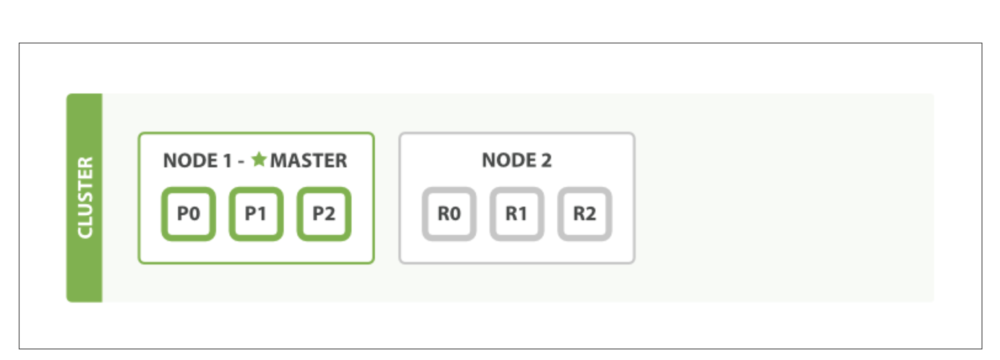

    添加一个node后

    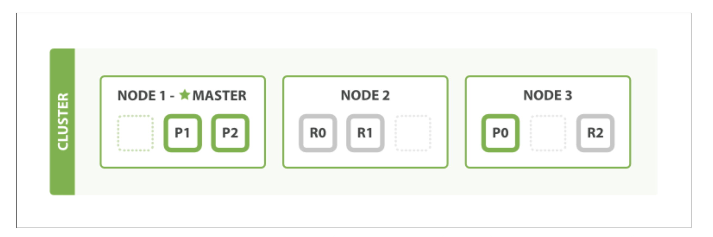

    或者动态配置, 把每个主分片对应的副本分片个数从1提升到2.

    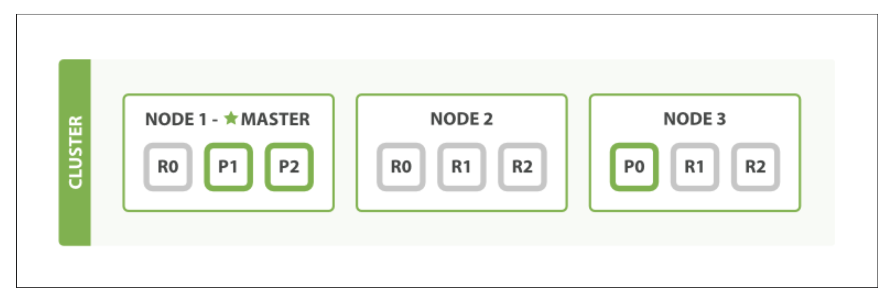

- 写入时是如何确定document写到哪个shard中呢?

     `shard = hash(routing) % number_of_primary_shards`

    `routing` : 默认是document ID也可以自定义, 只需保证hash函数是uniform的, 每个shard的负载都是均衡的了, 这也是primary shard的个数只能在创建index时定义之后不能改变的原因. 

- 主分片(primary shard)和副本分片(replica shard)之间是怎么交互的

    CRUD: 

    **先更新primiary shard, 同步更新replica**

    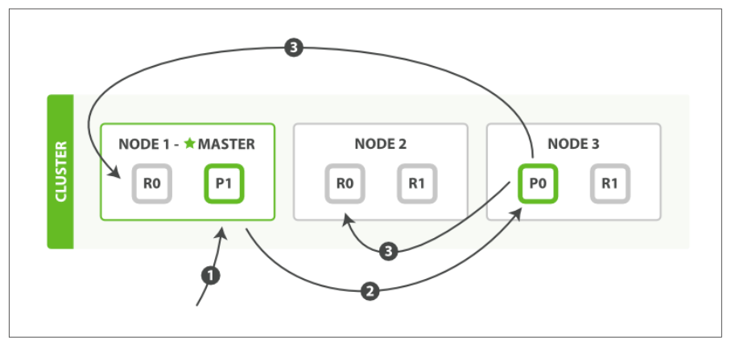

    1.  用户发送CRUD请求到node 1

    2. node 1 计算doc ID的hash发现doc 1存储在shard 0上

    3. node 1 将请求转发到 node 3, node 3 对文档进行相关数据操作

    4. 如果数据更新成功, node 3 会并行转发更新请求到 node 1, node 2. 待 node 1, node 2都更新完毕后, node 3 向用户返回请求执行结果. (也可以配置成异步, 不过不建议, 数据一致性是一方面, 设置成异步ES不能够Back Pressure, 会造成请求过多, 缓存堆积, 服务器过载)

    Side Note: 数据一致性颗粒度是可配置的:  one, all, `quorum = int( (primary + number_of_replicas) / 2 ) + 1`

    读取Document:

    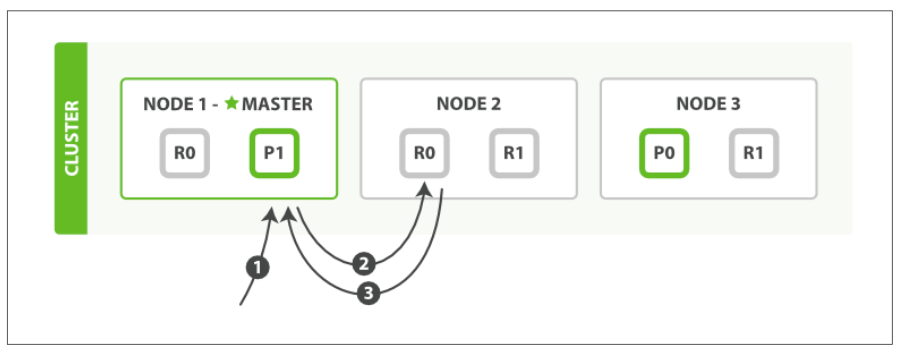

    不管主分片还是副本分片都可以用于读取数据, ES就Round-Robin来均衡请求负载 (如果之前配置了async可能会主分片有数据而副本分片来不及拷贝, 导致接口返回不一致的情况)

    ### 4.3 Search

    搜索主要分三大块: Mapping, Analysis, 和Query DSL. Analysis, Query DSL看官方文档即可, 这边就跳过了

    - Mapping

        **定义**: 正如我们在RDB中创建Table需要在Create语句中要详细写清楚每个字段定义, Type, 以及Constrain. ES同样需要需要这么一个配置文件来确定如何建立某个字段的倒排索引

        当我们insert一个document的时候, ES的analyzer会根据字段内容自动动态的给我们生成一个mapping文件, 下面是一个mapping文件例子:

        ```jsx
        {
        		"gb": {
                "mappings": {
                     "tweet": {
                        "properties": {
                           "date": {
                              "type": "date",
                              "format": "dateOptionalTime"
                           },
        									 "name": {
        											"type": "string"
                           },
                           "tweet": {
                              "type": "string"
                           },
                           "user_id": {
                              "type": "long"
                           }
        								} 
        						}
        				} 
        		}
        }
        ```

        但是实际上自动生成的mapping文件会有很多坑,  基本上要自己定义mapping文件会更安全,  不过mapping文件本身坑非常非常多, 这边就不赘述了.

    - ES是如何做到接近实时的分布式查找的呢? (Distributed Search Execution)
        - 复杂点:
            1. 对匹配结果未知, 所以必须要查询所有的shard
            2. 搜索匹配结果多样的,  可能document之间都有不同的mapping,  还需分析匹配度对搜索结果打分排序,  以及分页之类的.
        - Solution:
        分为两个大阶段: Query-then-fetch
            1. Query阶段

                会把用户的请求广播到每一个shard(可能是primary也可能是replica), 在每一个shard上执行query,  计算匹配度,  构建priority queue

                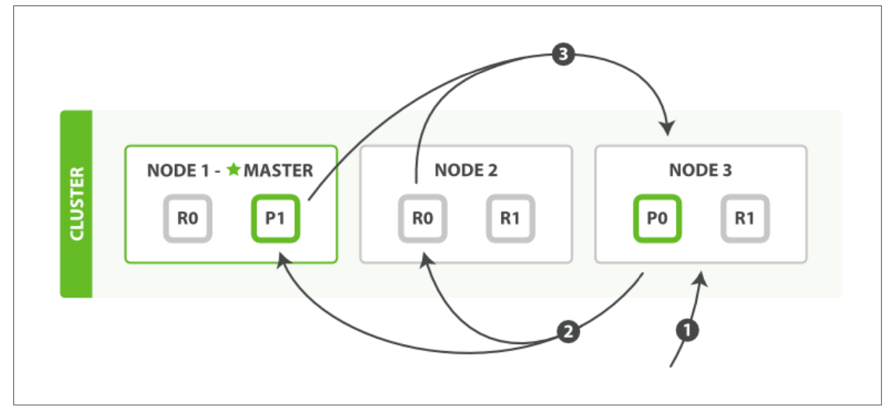

                1. 用户发送query到node 3, node 3会先建立一个空的priority queue, priority queue预留空间大小决定于分页入参
                2. node 3把query通过round-robin方式转发到其他两个node的shard上, 这也是为什么replica越多可以增加search的吞吐, 每个shard在本地执行query查询, 将匹配到的doc ID根据匹配度存在了每个node本地的一个prioirty queue上, 并将结果返回给node 3
                3. node 3根据拿到的每个shard最终的doc IDS和匹配度scores,  把所有doc IDs进行最终排序

                如果想查询多个index, 流程上和上述一摸一样, 因为理论上来说, 多index查询本质上就是shard数更多了而已

            2. Fetch阶段

                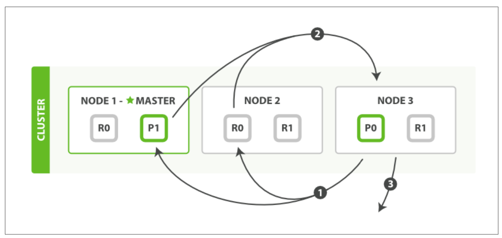

                1. node 3根据doc IDS以及分页数据向其他shards round-robin方式发送GET请求
                2. 根据doc ID定位shard, 再定位数据. 如果配置了的话, 会在这个阶段对结果做一次二加工(比如关键词高亮), 完成后将document返回至node 3
                3. node 3这边等所有的请求返回之后, 将结果整合, 返回至用户

            因为请求是round robin, 如果两个document的X字段有相同的值, 可能会导致两个document每次请求返回的顺序不一样, ES提供了preference参数保证同一个用户每次请求的shard都是一致的

    ### 4.3 更深一点, 为什么能near real-time

    - Immutability

        还记得之前说的每一个document都是immutable的吗, 在ES里, 每一个倒排索引都是不可变的.

        - 不需要加锁
        - 缓存优势
        - 索引在操作过程中生成的其他cache仍然有效
        - 有很多索引压缩算法能够将整个倒排索引压缩在内存中, 减少I/O

        缺点也很明显, 当每次想要添加新document时候都需要重新构建倒排索引

    - 动态更新索引 Dynamically Updatable Indices

        上面提到添加新document需要重新构建倒排索引, 怎么能够优化插入新数据时新构建倒排索引最大化利用不可变性的优势呢? 
        ES这边采用了Lucene的Pre-Segment Search方法, 大致思路是, 当有新document要插入时, 不会重新构建整个倒排索引, 有个In-memory buffer, 当buffer的数据停留了一定时间后, 会把buffer中的文档构建一个新的倒排索引 (附属索引), 并写(commit)在一个新的索引文件(segment)里. 当搜索时, 每个索引都会被请求, 将最后的结果整合返回到用户

        1. 当有新document要插入时, 不会重新构建整个索引,  先把每一个文件构建一个倒排索引, 然后存在一个In-memory buffer里面

            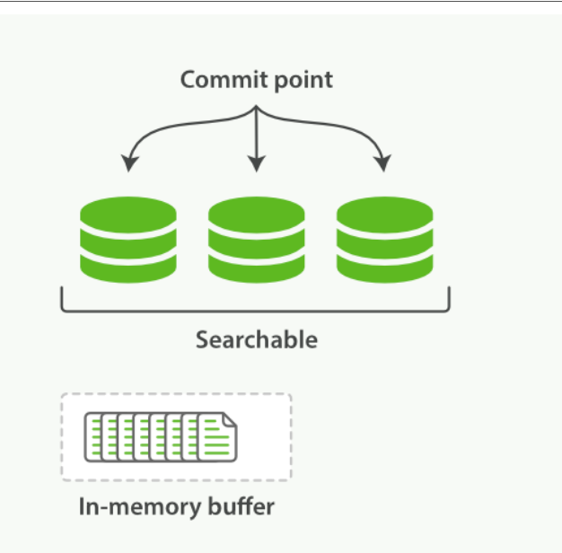

        2. 当过了一定的时间限制(默认1s, 可动态配置),  ES会commit buffer中的文档
            1. buffer中的document 的倒排索引 写到新的Segment文件中(附属索引), 这个过程成为刷新(refresh)
            2. 将这个新Segment文件路径的 + 已知Segment文件路径写到一个新Commit Point文件, 写入磁盘. 🤫
            3. 执行fsync系统调用, 将所有缓存中的数据写入磁盘. 🤫

                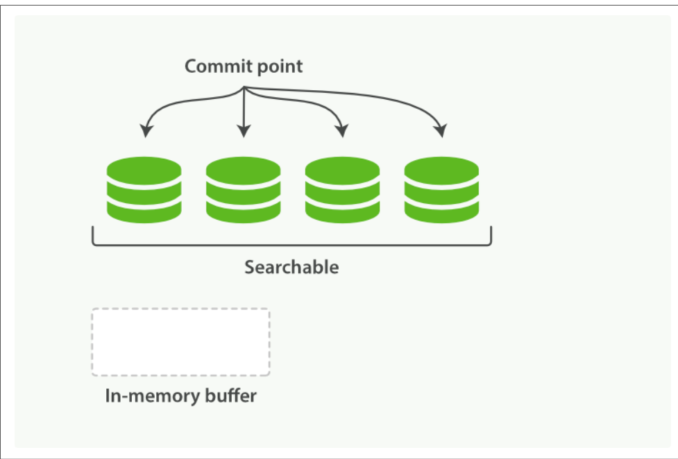

        3. 将新的Segment标记为可搜索, 未来搜索请求会遍历这个新Segment文件
        4. 将in-memory buffer标记为空, 可接受新document

        Segment: 文件存储着一个完整的倒排索引

        Commit Point:  一个文件存储着所有可搜索的segment路径

    - 删除和更新  Deletes and Updates

        Segment是Immutable的, 所以删除和更新都不会更改旧Segment文件.

        除了Commit Point文件以外, ES还会维护一个 `.del` 文件, 当一个文档删除的时候, 会在 `.del` 文件中标记Segment 1中的document 10.  在搜索时,  每个shard中被标记删除的文档仍然会被搜索,  但是在最后将结果返回给其他node时会去掉

        更新也是相似的原理, 会把旧document标记为删除, 把新版本的document写到新Segment中, 搜索时新旧版本均会被搜索, 返回时做过滤.

    - 我觉得没什么特殊的啊, 感觉反而复杂化了呀, 怎么就Near Real-Time Search了?

        上述根据 Immutable Segment 文件建立搜索的方法极大的提升的文档更新效率, 但仍然不够快. 真正的瓶颈是**磁盘**. `fsync` 十分十分耗时. ES的思路是直接去掉 `fsync` , 不必等待Segment文件持久化了以后才开始搜索. Lucene支持当文件被写入 filesystem cache 的时候就标记为可搜索, 这个优化极大程度的增加了搜索效率

        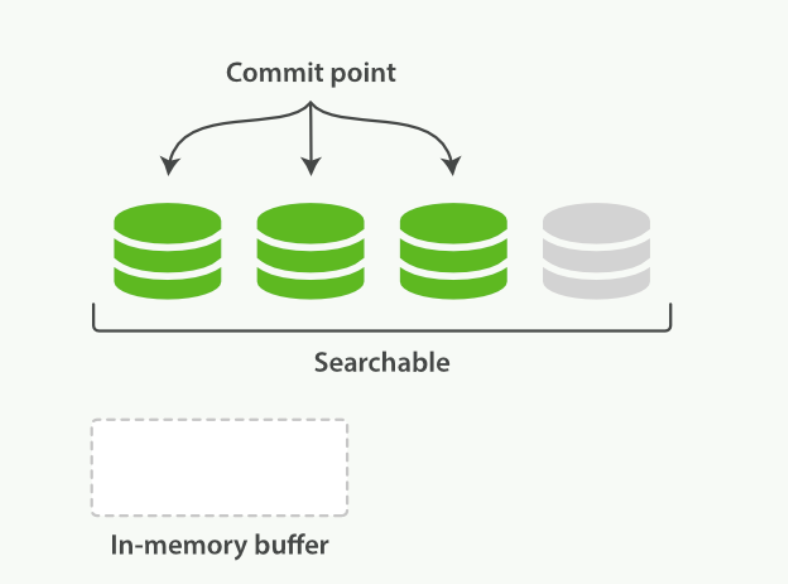

    - 持久化 Making Changes Persistent

        去掉 `fsync` 看似荒谬, ES自有一套办法 → `translog` 每一次对ES的改动都会写入到translog中.
        实际的插入文档流程:

        1. 当一个document成功建立倒排索引后, 我们不仅写入到In-memory buffer, 会同样写一份数据到Translog

            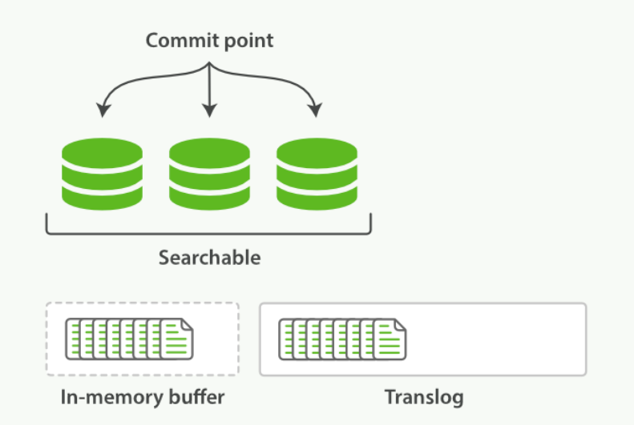

        2. 每秒进行一次刷新: 在in memory buffer中的文档写入到一个新的new segment, 不调用 `fsync` 将文件同步到磁盘, 将新Segment标记为可搜索
        3. 将in-memory buffer标记为空, 新Segment文件标记为可搜索

            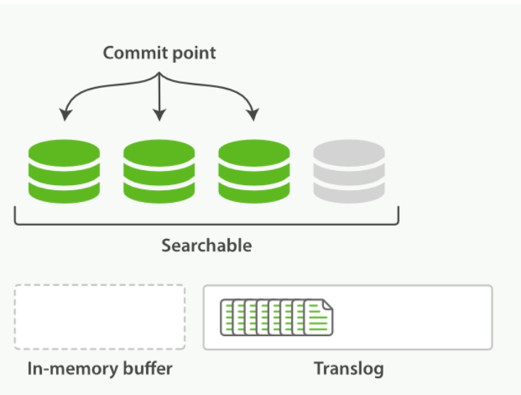

        4. 经过几次迭代, translog中文件越来越多

            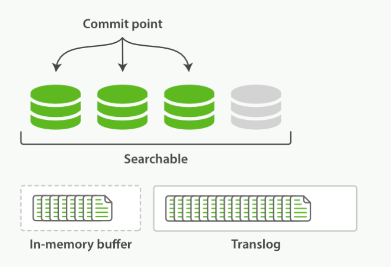

        5. 当translog中文件超出一定大小或超出一定时间限制(或者默认30mins, 可动态配置), 执行一次full commit
            - 把所有当前buffer中已有文件写入到新Segment
            - 标记buffer为空
            - 写入新Commit Point到磁盘
            - 清空file system cache, 调用 `fsync`
            - 标记Translog为空

            每次ES启动时, 都会先去查最近一次Commit Point, 读取Commit Point指向的Segment文件, 并将这些文件从磁盘读到缓存, 回放Translog中的每一个操作.

            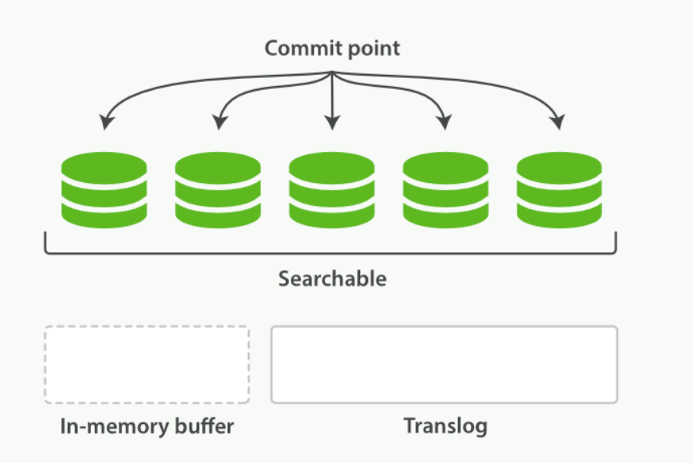

        Translog本身是会默认每5秒和磁盘同步 `fsync` 一次的. 你可能会想, 假如5秒区间内node挂了怎么办, 还记得每个shard实际上是有多个副本的且之间是相互隔离互不影响, 主分片和副本分片同时挂掉的可能性很低, 当然也可以配置 `fsync` 同步评率, 不过得以牺牲一定性能为代价. 

        CRUD操作实际上也会先去查询Translog再去查询Segment

    - Segment文件融合机制 Segment Merging

        你可能心中还有一个问题, 每次插入新document都会产生一个新的segment, segment文件难道不会多到爆炸吗? 很明显是有问题的呀, 每个文件都占用这系统资源, 而且文件有大有小很容易造成内存割裂, 而且我们每次搜索都会遍历每个Segment文件, 不必要的复杂度不会线性增加吗?

        ES这边采用了一个Segment融合机制 (Segment Merging): 

        1. 当我们创建索引时, refresh 会创建一个新的 Segment 文件并标记为可搜索
        2. 融合进程会在后台挑选几个文件大小较小的Segment文件融合成一个大的Segment文件, 这个过程不影响索引构建以及搜索

            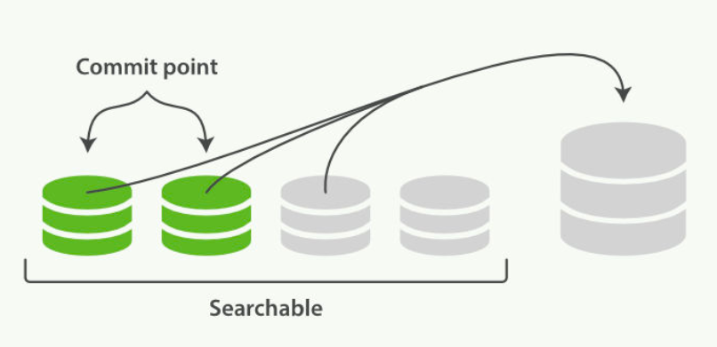

        3. 当融合结束后, 
            - 将融合后的Segment文件会flush到磁盘
            - 将新的Commit Point文件写入磁盘, 新的Commit Point文件指向融合后的大Segment文件, 而不是融合前的小Segment文件.
            - 标记新的Segment文件可搜索
            - 删除旧的融合前文件, (在 `.del` 文件中标记)

            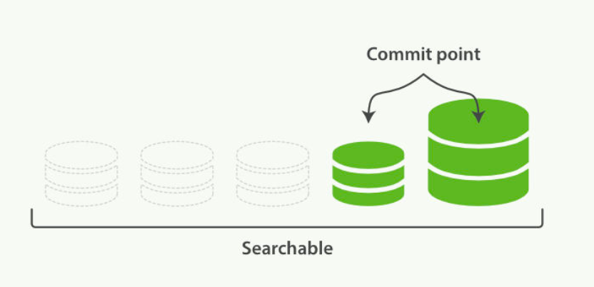

        可见, Merging过程是十分消耗系统I/O CPU资源的, ES会对融合进行一定的节流, 节流机制也是可以配置的

        这个Merging也是可以手动出发的, 有专门透出 `optimize` API

## 5. 扩展**阅读:**

- Google之父搜索领域关键论文 [The Anatomy of a Large-Scale Hypertextual Web Search Engine](http://infolab.stanford.edu/~backrub/google.html)
- [**Apache Lucene**时间序列数据库的秘密](https://www.infoq.cn/article/database-timestamp-02) (个人认为Roaring Bitmap部分作者理解错了，其他地方值得阅读)
- [Frame of Reference and Roaring Bitmaps](https://www.elastic.co/blog/frame-of-reference-and-roaring-bitmaps)
- [Analysis of Lucene - Basic Concepts](https://www.alibabacloud.com/blog/analysis-of-lucene---basic-concepts_594672)
- 亚马逊放弃ES, 重新用原生Lucene [What Amazon gets by giving back to Apache Lucene](https://aws.amazon.com/blogs/opensource/amazon-giving-back-apache-lucene/)
- [深入理解Elasticsearch写入过程](https://zhuanlan.zhihu.com/p/94915597)
- [Lucene 查询原理及解析](https://www.infoq.cn/article/ejeg02vroegvalw4j_ll)
- 国外大佬老博文 [Lucene made my app embarrassingly fast](http://madbean.com/2004/mb2004-7/)
- 国外大佬对flushing跑的实验 [265% indexing speedup with Lucene's concurrent flushing](http://blog.mikemccandless.com/2011/05/265-indexing-speedup-with-lucenes.html)
- IBM的Solr4博客 [Next-generation search and analytics with Apache Lucene and Solr 4](https://www.ibm.com/developerworks/library/j-solr-lucene/)
- [Definite Guide](https://www.elastic.co/guide/en/elasticsearch/guide/index.html)