# ElasticSearch. An intro.

## **0. 一句话概括ElasticSearch**

[Elasticsearch](https://www.elastic.co/elasticsearch/)（简称ES）是一个**分布式、可扩展、接近实时(Near real-time)** 的搜索与数据分析引擎。ES不仅仅支持全文搜索，还支持结构化搜索、数据分析、复杂的语言处理、地理位置和对象间关联关系等。

## 1. 基础概念:

为了能够更轻松的阅读本文, 先快速的介绍下ES的一些基本术语, 术语根据包含关系逐级递减:

- Cluster: 就是集群, 包含一个或多个节点 (node), 每个节点上都运行着一个ES实例
- ES Index: ES存储数据的地方, 可以暂时理解为RDB中的database
- Type: 存放数据Object定义, 可以暂时理解为RDB中的table
- Document: 数据, JSON格式
- Field: 字段都是Inverted Indexed (即可搜索, 没有被Inverted Index的字段不可搜索),

## 2. 为什么用ES

- **简洁方便, 易上手**

    ES本质上是[Apache Lucene](https://lucene.apache.org/)的的一个服务层封装，Lucene可以说是当下最先进、高性能、全功能的搜索引擎库。但是缺点也十分明显，Lucene是个Java库，且原理十分复杂. ES将Lucene的诸多优良特性以及分布式操作封装成方便的JSON based RESTful API。从开发者角度来看, 就无须绞尽脑汁想办法整合这个库到项目, 并实现分布式操作了。

- **分布式 + 高可用性**
    - 所有的Index都能配置分片(sharding)
    - 每个分片都可配置多个副本(replica)
    - 每个分片副本均可以用于搜索/读取/插入新数据
- **接近实时的搜索速度 Near-real-time**

## 3. 实际操作

概念都是抽象的, 咱们来看一些实际操作吧

### 3.0 基础CRUD

通过HTTP的Verb (PUT, DELETE, POST, GET, HEAD) 来区分对ES的不同操作

请求格式: `<host>:<port>/<index>/<type>/<endpoint>?<parameters>`

> Upsert 数据更新插入

在下面这个例子中, 我们会把“John Smith”的一些信息插入到 `megacorp` 这个 ES Index 中的 `employee` Type 下 (对应RDB中的 `megacorp` database 中的 `employee` table)

请求结尾的`pretty`目的是 `jsonify` 返回结果

```bash
curl -X PUT "localhost:9200/megacorp/employee/1?pretty" 
     -H 'Content-Type: application/json' 
     -data '
        {
            "first_name" : "John",
            "last_name" :  "Smith",
            "age" :        25,
            "about" :      "I love to go rock climbing",
            "interests": [ "sports", "music" ]
        }
        '

```

返回

```json
{
    "_index" : "megacorp",
    "_type" : "employee",
    "_id" : "1",
    "_version" : 1,
    "result" : "created",
    "_shards" : {
        "total" : 2,
        "successful" : 1,
        "failed" : 0
    },
    "_seq_no" : 0,
    "_primary_term" : 1
}

```

咱们来看下返回中的字段:

- `_index`, `_type`, `_id` 对应插入的 ES Index, Type 名, 以及插入后返回插入数据的 Document ID
- `_version`, `_seq_no`, `_primary_term` ES 通过乐观锁中的版本号机制来实现并发控制. 在请求中可以带上版本号, 分普通/数据库迁移两种情况. 详情见官网[文档](https://www.elastic.co/guide/en/elasticsearch/reference/current/optimistic-concurrency-control.html)
- `_shards` 此变更影响的分片. 上述变更ES实例里共有2个分片, 数据插入到了其中1个分片中.

除此之外一些其他注意点

- ES的document是不可变的(immutable)的, 也就是说要想更新一个document, ES 不会去内存/磁盘中定位旧 document, 然后做 inplace 更新. However, ES 会把多个 document 的数据写在磁盘里的一个segment 文件里, 每当我们想要插入/更新/删除, ES 只会把更新信息以 **append** 的方式记录在Segment 文件中. 所以在一个 Segment 文件中, 同一个 Document 的新老数据是并存的.

    原因和 ES 的底层 Apache Lucene 的实现有点关系, 这么设计第一眼看上去可能难以理解, 但是在一个文件中定位到旧 document 并更新十分的低效率 (定位 + 上锁), 如果 document 是 immutable 的话新 document 就可以直接写到新segment 里面不用管旧的了. 还有缓存优势, 这个优化由于是 ES 做到高速搜索的重点原因, 笔者会在下文细谈.

- 删除的话语法类似, ES 会把需要删除 Document 的 Document ID 记录到一个专门存储失效数据文件后再异步删除 (即tombstone), 很常见的设计方法, 这边不再赘述

> Simple Search

在下面这个例子中, 我们会在 `megacorp` 这个 ES Index 中的 `employee` Type 下搜索所有 `about` 字段中带有 "rock climbing" 的所有数据

请求

```bash
curl -X GET "localhost:9200/megacorp/employee/_search?pretty" 
     -H 'Content-Type: application/json' 
     -d'
        {
            "query" : {
                "match" : {
                    "about" : "rock climbing"
                }
            }
        }
        '

```

返回

```json
{
   ...

   "hits": {
      "total":      2,
      "max_score":  0.16273327,
      "hits": [
         {
            ...
            "_score":         0.16273327, 
            "_source": {
               "first_name":  "John",
               "last_name":   "Smith",
               "age":         25,
               "about":       "I love to go rock climbing",
               "interests": [ "sports", "music" ]
            }
         },
         {
            ...
            "_score":         0.016878016, 
            "_source": {
               "first_name":  "Jane",
               "last_name":   "Smith",
               "age":         32,
               "about":       "I like to collect rock albums",
               "interests": [ "music" ]
            }
         }
      ]
   }
}

```

返回数据还是很直观的:

- `hits` 所有命中了搜索条件的数据
- `_score` ElasticSearch 会把命中了的数据根据匹配度计算出匹配值, 这个匹配值的计算默认的是 Lucene 广为人知的 TF-IDF 文本挖掘算法[[Source](https://lucene.apache.org/core/4%5C_0%5C_0/core/org/apache/lucene/search/similarities/TFIDFSimilarity.html)]. 当然也可以自己定义 Similarity 算法, 但这个超出本文的范围, 这边就不赘述了.
- 第二个返回结果中的 `about` 字段里只命中了 "rock climbing" 中的 "rock" 所以匹配分相较第一个数据较低. 这也是说明了 ES 默认是全文搜索(Full-Text Search), 会把用户请求的文本先分词再搜索. 如果用户想要强制搜索整个词组 (即做字符串匹配) 可以使用 ElasticSearch Query DSL 中的 `match_phrase` 语法即可

### 3. 1 机构化搜索 & 聚合操作 Structured Search & Aggregation

除了上面看到的一些简单的CRUD操作, ElasticSearch 还支持一些相对复杂的结构化搜索 (类似 SQL 中复杂的 Conditon) 和聚合操作. 我们也快速的看一些简单的例子:

> 复杂条件搜索 Structured Search

在这个搜索请求中, 我们想要搜索 `megacorp` 这个 ES Index 的 `employee` type 下所有 `last name` 是 “smith” 并且年龄大于 30 的数据.

请求

```bash
curl -X GET "localhost:9200/megacorp/employee/_search?pretty" 
     -H 'Content-Type: application/json' 
     -d'
        "query" : {
            "bool" : {
                "must" : {
                    "match" : {
                        "last_name" : "smith" 
                    }
                },
                "filter" : {
                    "range" : {
                        "age" : { "gt" : 30 } 
                    }
                }
            }
        }
        '

```

> 聚合操作 Aggregations

在这个聚合请求中, 我们想要根据 `interests` 字段来做聚类(即SQL中的`group by`), 并计算出来每个类 (ES称之为`bucket`) 中的所有数据的平均年龄, 将结果存在 `avg_age`字段中

请求

```bash
curl -X GET "localhost:9200/megacorp/employee/_search?pretty" 
     -H 'Content-Type: application/json' 
     -d'
        {
            "aggs" : {
                "all_interests" : {
                    "terms" : { "field" : "interests" },
                    "aggs" : {
                        "avg_age" : {
                            "avg" : { "field" : "age" }
                        }
                    }
                }
            }
        }
        '

```

返回

```json
...
"all_interests": {
   "buckets": [
      {
         "key": "music",
         "doc_count": 2,
         "avg_age": {
            "value": 28.5
         }
      },
      {
         "key": "forestry",
         "doc_count": 1,
         "avg_age": {
            "value": 35
         }
      },
      {
         "key": "sports",
         "doc_count": 1,
         "avg_age": {
            "value": 25
         }
      }
   ]
}

```

返回结果十分清晰明白, 这边就不再赘述.

### 3.2 有趣小功能

这边咱们再看一些 ES 一些方便的有趣小功能

> Highlight

关键词高亮, 搜索请求中带上 `highlight` ES 会通过在被命中的关键词周边加上`<em>`来方便前端实现高亮.

请求:

```bash
curl -X GET "localhost:9200/megacorp/employee/_search?pretty" 
     -H 'Content-Type: application/json' 
     -d'
        {
            "query" : {
                "match_phrase" : {
                    "about" : "rock climbing"
                }
            },
            "highlight": {
                "fields" : {
                    "about" : {}
                }
            }
        }
        '

```

返回:

```json
{
   ...
   "hits": {
      "total":      1,
      "max_score":  0.23013961,
      "hits": [
         {
            ...
            "_score":         0.23013961,
            "_source": {
               "first_name":  "John",
               "last_name":   "Smith",
               "age":         25,
               "about":       "I love to go rock climbing",
               "interests": [ "sports", "music" ]
            },
            "highlight": {
               "about": [
                  "I love to go <em>rock</em> <em>climbing</em>" 
               ]
            }
         }
      ]
   }
}

```

- 除此之外还支持模糊查询, 搜索联想词, 以及地理位置查询等等, 这边就不赘述了

## 4. 原理 (本文核心)

从现在开始本文的关键核心, 我们会从宏观视角逐步到微观一步步理解 ElasticSearch 是怎么做到接近实时的搜索的同时确保了数据的高可用性的.

还记得我们在本文 “Section 1 基础概念” 通过和RDB做类比来带领大家粗略的理解了一些 ElasticSearch 的基础概念吗, 接下来我们会先更加严谨的重新定义之前介绍过的基础概念.

### 4.1 集群 Cluster

- 定义: cluster 是一个或多个 node 组成的集群, 每一个 node 上都运行着一个 ES 实例. ElasticSearch 的集群正如它的名字所说, 自带很好的延展性 (elastic), 会自动处理负载均衡, 不需要用户手动扩容.
- 正如任何一个分布式系统, 为了确保每个服务器之间的数据的一致性 (consistency) 和内部状态的共识(consensus), ElasticSearch 也有 master node 的定义.
    - master node 的唯一职责是用于管理集群级别的操作, 比如创建删除一个ES index, 或在集群中添加/删除一个 node (职责类似大家熟悉的 Consul 中的 server 和 agent 的关系), master node 不参与 document 级别的改动. 每一个节点都可以是 master, 当 master node 服务挂掉了, 会通过 Paxos 算法进行 leader election. Paxos 算法由于比较复杂, 我这边会另外写一遍文章将 Paxos 和 Raft 协议一并做个介绍分析.
    - 因为每一个 node 都是一个 ES 实例, 用户可以向任何一个 node 发送请求, 被请求的 node 会进行服务发现, 定位到目标数据所在 node, 并对数据进行处理返回给用户. 具体流程下文会有介绍. 注意 master node 不参与上述操作.

### 4.2 ES Index

- 定义: index 是 ES 存储数据的地方, 角色类似于RDB中的 database, 实际上, ES Index是一个指向多个物理分片 (shard) 的 logic namespace, 每一个分片都是一个 Apache Lucene 的实例 (即一个独立的搜索引擎), 用户的 document 都会在分片上存储, 但用户不会直接和分片交互, 由ES index负责用户交互以及负载均衡.
- 这边关系可能有点乱, 笔者这边画了个图来给大家梳理一下:

    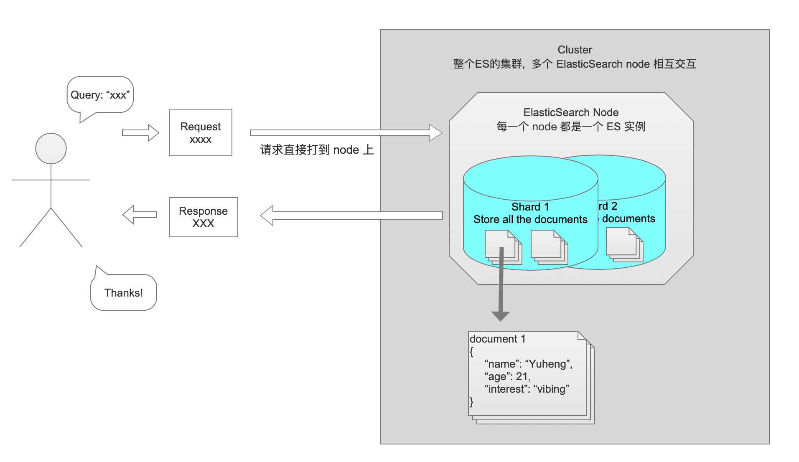

- 数据 document 存在物理分片 shard 里面
- 每个 shard 分片只被一个 node 来管辖
- 每个 node 存储着一个或多个 shard
- 用户直接发送请求到任意一个 node 上, 这个 node 负责定位这个数据该交给哪个 node 来处理
- 接受请求的 node 负责服务发现以及转发请求到处理数据的 node 上
- shard 分片分为两种: 主分片 (primiary shard) 和副本分片 (replica shard), 主分片个数在创建 index 时候就固定了, 但是每一个主分片拥有的副本分片个数是可以动态配置的.
- [问] 这边大家可能就有疑问了. 请求既然是直接打到任意一个 node, 写入时是如何确定 document 该写到哪个 shard 中呢?

    [答] ElasticSearch 这边用了一个很普遍的数据库再平衡 (rebalancing) 设计模式: `hash % N`

    每个写入 ElasticSearch 的 Document 都会有一个独一无二的Document ID, 可能是用户请求的时候声明的也可能是 ES 自动给数据生成的. 当写入或者根据 Doucment ID 查询数据时, ES 会根据下面这个很简单的公式来定位这个 Documnt 对应的 shard.

    ```
    shard # = hash(document_id) % number_of_primary_shards
    ```

    因此, 只需保证 hash 函数是 uniform 的[[什么是 uniform](https://en.wikipedia.org/wiki/SUHA_%5C(computer_science%5C))], 每个shard的负载都是均衡的了, 这也是primary shard 的个数只能在创建 index 时定义, 之后不能改变的原因.

- ElasticSearch 在最初设计时主要目标之一就是灵活的水平延展性, ES 针对某个 index 水平扩容是十分方便的. 咱们来看个例子:
    - index有三个主分片(P0, P1, P2)每个主分片有一个副本分片(R0, R1, R2)

        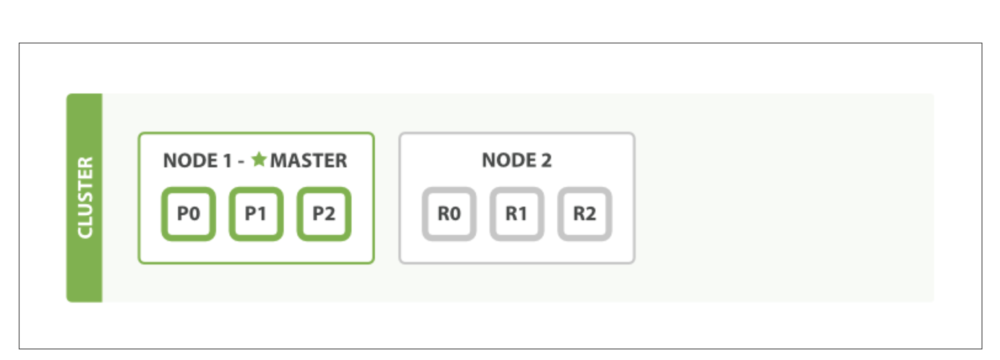

    - 添加一个node后 (ES 没有 Consul 那么方便, 新加一个 node 需要手动在config文件配置 IP 等信息)

        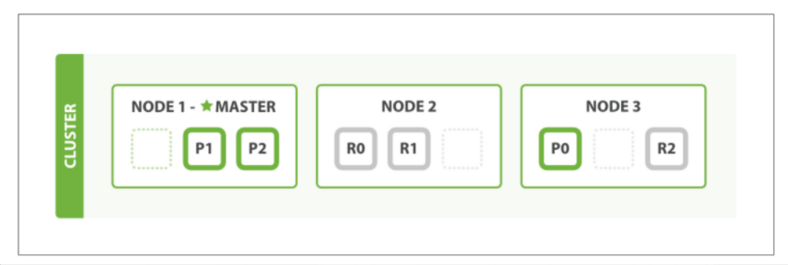

    - 或者动态配置, 把每个主分片对应的副本分片个数从1提升到2. ES 会确保每个 node 不会拥有重复的 Shard 以防止其中一个服务挂掉导致部分数据不可用.

        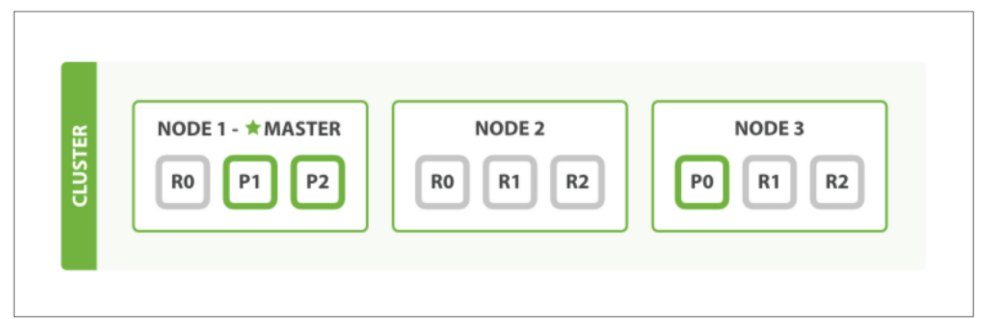

- [问] 你可能有疑问了, 当新加了一个 node 后 ES 如何进行服务发现的

    [答] ES 会读取配置信息, 通过经典的流行病协议 (Gossip Procotol) 进行服务发现以及检查每个节点的健康状态, 请求发送支持单播 (unicast) 以及组播 (muticast)

- [问] 我猜大家还会好奇 ES 在新加/删除一个 node 后是怎么重新分配 nodes 中的 shards 来保护数据可用性以及负载均衡的?

    [笔者反问] 这其实是一个很简单的算法题, 看看你能不能用贪心算法自己写个Solution出来?

- [问] 主分片 (primary shard) 和副本分片 (replica shard) 之间是怎么交互的呢?

    [答] 咱们先看下基础的CRUD:

    大致思路是: **先更新 primary shard, 同步更新replica**

    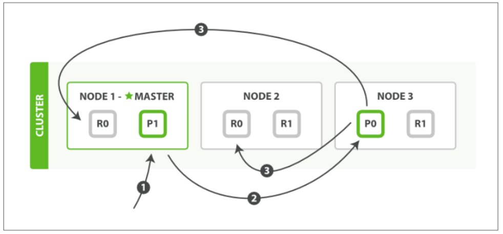

    1. 用户发送 CRUD 请求到 node 1
    2. node 1 计算 Document ID的 hash 发现这个文档存储在 shard 0 上, 而 shard 0 的主分片目前存储在 node 3 上面
    3. node 1 将请求转发到 node 3, node 3 对文档进行相关数据操作
    4. 每次对数据的更新会先写入主分片, 再同步到副本. 如果数据 node 1 更新成功, node 3 会并行转发更新请求到 node 1, node 2. 待 node 1, node 2 都更新完毕后, node 3 向用户返回请求执行结果.

    注意点:

    - 这边 ES 也支持将该流程配置成异步, 不等所有 node 处理完请求只要 node 3 完成就向用户返回. 这是系统设计中很经典的 trade-off 了, 不过笔者以及官方都不建议配置成异步, 数据一致性难以保障是一方面, 设置成异步 ES 不能够实现 **Back Pressure**, 假如有一个请求执行时间长占有资源多, 过早返回请求可能会导致用户对服务器能力过于乐观, 打一堆请求过来, 造成请求过多, 缓存堆积, 服务器过载. 如果设置成同步进行, ES 服务器会在服务器高负载时返回 `503`
    - 和所有分布式系统一样, 数据一致性颗粒度是可配置的:
        - one: 只要一个 node 成功就向用户返回 [不建议]
        - all: 所有的 node 都成功后才返回
        - 大多数: `quorum` 个 node 成功后返回给用户.

            分布式领域的经典公式了:

            ```
            quorum = int( (primary + number_of_replicas) / 2 ) + 1
            ```

    读取 Document:

    .png)

    - 因为写入时我们确保了数据一致性, 不管主分片还是副本分片都可以用于读取数据, ES通过 Round-Robin 来均衡请求负载
    - 如果之前配置了异步写入可能会主分片有数据而副本分片来不及拷贝, 导致接口返回不一致的情况

### 4.3 搜索 Search

搜索主要分四大块: Mapping, Analysis, Query DSL, 以及接近实时的搜索速度 (Near-real-time)

*Analysis*: 主要负责对请求文本以及插入数据文本进行一些分词 (Tokenization), 类型识别 (NER), 以及权重计算 (TF-IDF)等, 因为主要涉及 NLP 领域知识, 这边就先跳过不讲了.

*Query DSL:* 即 ES 搜索请求中的一些语法, 看官方文档即可也没啥好说的, 这边就跳过了

*Mapping:* ES 需要对插入的数据进行 Schema 约束, mapping 文件存放着定义数据格式类型的 schema. 语法格式和很多 NoSQL Database 中的 JSON Schema 定义及其相似. ES同样需要需要这么一个配置文件来确定如何建立某个字段的倒排索引.

当我们 insert 一个 document 的时候, ES 的 语义分析器 (analyzer) 会根据字段内容自动动态的给我们生成一个 mapping 文件, 下面是一个 mapping 文件例子:

```json
{
    "gb": {
        "mappings": {
             "tweet": {
                "properties": {
                   "date": {
                      "type": "date",
                      "format": "dateOptionalTime"
                   },
                   "name": {
                       "type": "string"
                   },
                   "tweet": {
                      "type": "string"
                   },
                   "user_id": {
                      "type": "long"
                   }
                } 
            }
        } 
    }
}

```

但是实际上自动生成的 mapping 文件会有很多坑, 基本上要自己定义 mapping 文件会更安全, 不过mapping 文件本身坑非常非常多, 咱们字节有个避坑指南, 建议大家看一下: [[汇总] ES 使用过程中应尽量避免的 高危操作](https://bytedance.feishu.cn/docs/doccnxcYr4dLOVkMc1troUIbZWc#)

笔者在本文着重和大家讨论 ES 如何做到**接近实时的分布式查找**

- ES 是如何做到接近实时的分布式查找的呢? (Distributed Search Execution)

    复杂点:

    - 对任何一个搜索请求所匹配的结果未知, 所以每次搜索必须要查询所有的 shards
    - 搜索匹配结果多样的, 可能 document 之间都有不同的 mapping, 还需分析匹配度对搜索结果打分排序, 以及分页之类的.

    ES 提出的 Solution: 分为两个大阶段: **Query-then-fetch**

    - Query 阶段

        分布式搜索本质上就是从多个服务中选取 score 最大的 Top-K 数据 (面试被问烂了有木有). 因此ES的大致思路会把用户的请求广播到每一个 shard (可能是 primary 也可能是 replica), 在每一个 shard 上执行query, 计算匹配度, 构建 priority queue

        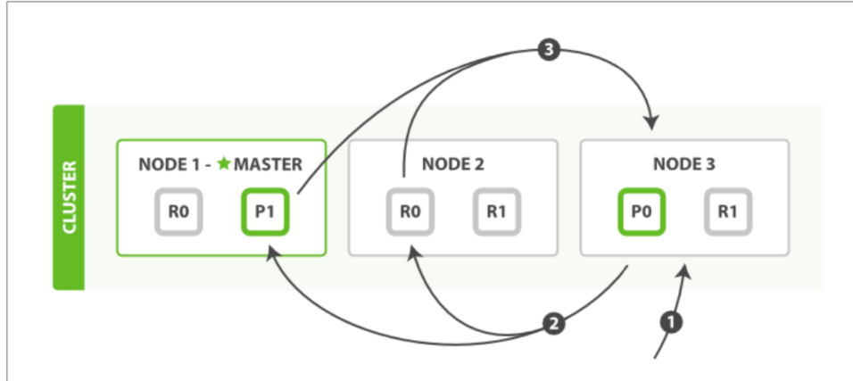

        1. 用户发送 query 到 node 3, node 3 会先建立一个空的 priority queue, priority queue 预留空间大小决定于分页入参, 如果没有入参分页大小的话, ES 会默认设置 `1000`
        2. node 3 把 query 通过 round-robin 方式转发到其他两个 node 的所有 shard 上 (包括副本分片), 这也是为什么 replica 越多可以增加 search 的吞吐的原因, 我们可以让 node 1 在 shard 1 的主分片上做前 1000 个数据搜索, 在 node 2 上 shard 1 的副本分片上做对第 1000-2000 个数据的搜索, 多线程的处理搜索.
        3. 每个 shard 在本地执行 query 查询, 将匹配到的 Document ID 根据匹配度存在了每个 node 本地的一个 prioirty queue 上, 并将结果返回给 node 3
        4. node 3 根据从每个 node 上拿到的最终的 Document IDs 和匹配度 scores, 把所有 Document IDs 进行最终排序

        如果想一个 query 查询多个 index, 流程上和上述一模一样, 还记得 ES Index 的定义吗? 每个ES Index 是指向物理分片应用层的的 logic namespace. 因此理论上来说, 多 index 查询本质上就是 shard 数更多了而已

    - Fetch阶段

        在Query阶段我们拿到了最终结果的 Document IDs, 我们再通过这些 IDs 抓取文档的数据, 做一些后置数据处理, 返回给用户

        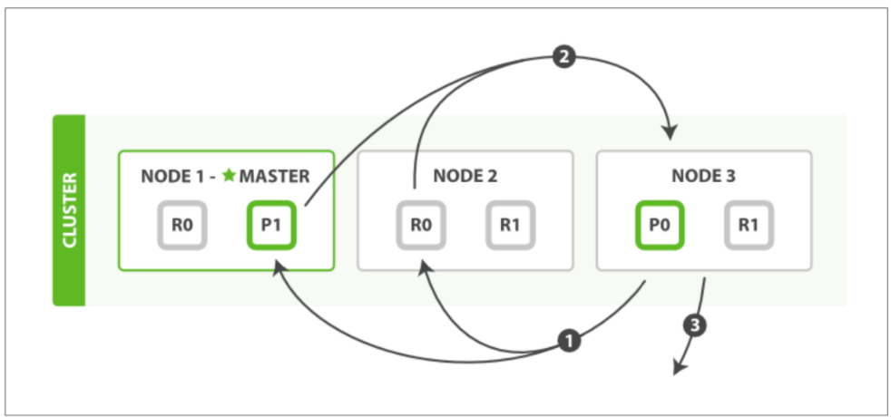

        1. node 3 根据 Document IDs 以及分页数据向其他 nodes 以 round-robin 方式发送 GET 请求
        2. 根据 Document IDs 计算 hash 来定位 shard, 再定位数据. 如果配置了的话, 会在这个阶段对结果做一次二加工 (比如之前提到的关键词高亮), 完成后将 Document 数据返回至 node 3
        3. node 3 这边等所有的请求返回之后, 将结果整合, 返回至用户

    这边笔者带领大家学习了 ES 如何通过设计 Query-then-Fetch 模式来做到每次搜索请求的负载绝对均衡到每一个服务器, 并且通过广播请求到 replica 来最大化搜索处理的并发性

    **注意:** 因为请求是 round robin, 如果两个 document 最后计算出来的匹配值 score 一摸一样, 而我们又是根据 score 来进行排序, 很可能会导致相同的请求, 每次这两个有相同 score 的 document 返回的顺序不一样, 为了解决这个问题, ES 提供了 `preference` 参数 (一般配置为用户当前的 session ID), 在第一次搜索后, ES 会记录此次请求 Shard 的顺序以及一些搜索参数到缓存, 以 `preference` 参数为 key. 这样未来搜索保证同一个用户每次请求时 ES 访问 shard 的顺序始终是一致的.

- 4.3 更深一点, 为什么能 **near real-time**

    实际上, ES 对为了做到 near-real-time 搜索做出的优化远不止这些. 笔者在这个 section 会带大家往底层挖一挖. 还记得笔者在 Section 3 和大家快速提了一下 ES 的 Document 是 Immutable 的吗?

    > ES的document是不可变的(immutable)的, 也就是说要想更新一个document, ES 不会去内存/磁盘中定位旧 document, 然后做 inplace 更新. However, ES 会把多个 document 的数据写在磁盘里的一个segment 文件里, 每当我们想要插入/更新/删除, ES 只会把更新信息以 append 的方式记录在Segment 文件中. 所以在一个 Segment 文件中, 同一个 Document 的新老数据是并存的.

    > 原因和 ES 的底层 Apache Lucene 的实现有点关系, 这么设计第一眼看上去可能难以理解, 但是在一个文件中定位到旧 document 并更新十分的低效率 (定位 + 上锁), 如果 document 是 immutable 的话新 document 就可以直接写到新segment 里面不用管旧的了. 还有缓存优势, 这个优化由于是 ES 做到高速搜索的重点原因, 笔者会在下文细谈.

    这个其实是一个很经典的数据存储的数据结构: **LSM Tree** ( Log-structured Merge Tree) 和 **SSTable** (Sorted String Table). 很多全球著名的数据存储引擎, 比如 Google 的 LevelDB 和 BigTable, Facebook 的 Cassandra, 以及众所周知的 SQLite, 底层都是 LSM-Tree, 而不是学校里面经常学到的 B-Tree.

    这边笔者快速简洁的给大家入一下门 LSM Tree, 如果大家想更深入的理解一下 LSM, 笔者最近阅读神书《Design Data Intensive Application》记录的[随笔](https://www.notion.so/Design-Data-Intensive-Application-73dcecac532f4d94bd1082aa56c5b9a7)内有非常详细的LSM Tree介绍以及和 B-Tree 的比较分析. 或者大家有时间非常推荐直接读 Google 的 BigTable [论文](https://research.google/pubs/pub27898/), 这篇论文不但提出了数据存储的优化, 而且对当今很多 OLAP 中 Column-Oriented Database 诞生产生了深远影响.

    SSTable 结构图:

    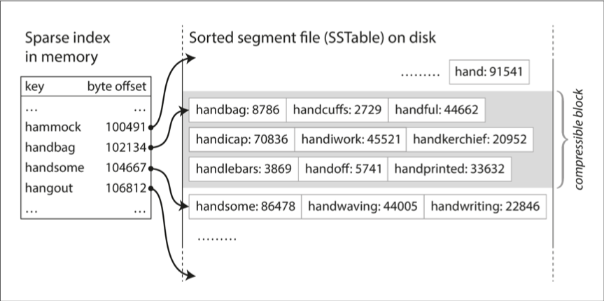

    整体结构分为内存中的 **Memtable** 存储着 Key-Value Pair 和 磁盘中存放完整数据的 **Segment** 文件

    - **Memtable**: Key 是 String 且根据 String 的值会进行排序, Value 是在磁盘中对应存放数据的 Segment 文件指针以及 byte offset. ES 会根据输入的文档进行分词, 然后对每个词建立倒排, 所以对 ES 来说, 内存中的 Key 存储的就是建立倒排的单词, Value 存储着指向 Segment 文件的指针数组来做 Secondary Index, 最后 Secondary Index 指向着磁盘上实际的 Offset.
    - **Segment**: ES 会根据输入的文档进行分词, 然后对每个词建立倒排, 所以 Segment 文件中存储的就是建立索引的单词所存在的 Document IDs 的 Posting List.

    在 LSM Tree 中, 数据的写入和更新都是 append-only 到一个 segment 文件中, 当这个 segment 文件达到了一定大小, 文件会自动分裂成新的 Segment 文件. 也就是说假如我 Insert/update 一个新的 Document 到 ES 里面, ES 会把 Posting List 等信息 append 到最近一次更新的 Segment 文件后面. 记录本次写入的磁盘 Offset 以及文件指针, 写入到内存中的 Memtable 中. 而不是先读取 Memtable 定位到磁盘中存储 Posting List 的位置然后做 Inplace 更新. 当磁盘中 Segment 到达了一定的大小或者 过了一定时间段后 ES 会将磁盘中的 Segment 文件在一个后台进程中进行 Merge 操作, 确保我们磁盘中的 Segment 文件不会占有过多系统资源, 这么做有如下几个好处:

    - Append-only = sequential write operation (顺序写入). **顺序写入很快!!!! 顺序写入很快!!!! 顺序写入很快!!!!** 顺序写入的缓存优势十分明显, 且不管在 HDD 还是 SSD 都是表现极佳的. 并且如果我们做 Inplace 更新的话, 由于用户请求是随机的, 很容易造成随机磁盘读写, 众所周知, 一个存储系统设计的随机磁盘读写越多, 就设计得越失败.
    - 完全不需要担心并发控制和崩溃恢复. 数据的读写因为都是 append-only, 根本就不需要加锁. 而且我们完全不需要担心当我们在 overwrite 一个数据时系统突然挂了, 导致系统中新数据和旧数据在数据库中并存. ES 在成功写入数据后会紧跟着写一个特殊标识, 在读取时没有特殊标识结尾的数据跳过即可.
    - 定期的 Merge 已有的 Segment 文件能极大程度的避免磁盘空间逐渐割裂, 浪费系统资源. (Defragmentation) 可见, Merging 过程是十分消耗系统I/O CPU资源的, ES会对融合进行一定的节流, 节流机制也是可以配置的. ES 甚至有专门透出接口可以手动触发.
    - 内存中的 MemTable 也不需要把每一个 String 都建立一个 Key, 因为 Key 是排序的, 我们只需要当磁盘中的 Segment 文件达到一定大小的时候, 把最近一次写入的 String 存成 Key 就行. 假如 Memtable 中有 Key :

        ```
        {
            ...
            "adapt":  segment 1,  offset  0,
            "admire":  segment 2,   offset  31,
            ...
        }

        ```

        我们想要查询 administration, 把 administration 根据字符串排序进行二分查找, 发现 administration 比 adapt 大比 admire 小, 因此我们只需要在从 segment 1, offset 0 到 segment 2, offset 31 中间查询数据即可, 这个优化确保了 Memtable 始终能在内存.

- 动态更新索引 Dynamically Updatable Indices

    上面提到添加新document需要重新构建倒排索引, 怎么能够优化插入新数据时新构建倒排索引最大化利用不可变性的优势呢?

    ES 这边采用了 Lucene 的 Pre-Segment Search 方法, 大致思路是, 当有新 document 要插入时, 不会重新构建整个倒排索引, 会先写入一个 In-memory buffer, 当 buffer 的数据停留了一定时间后, 会把buffer 中的文档构建一个新的倒排索引 (附属索引), 并写(commit)在一个新的索引文件(segment)里. 当搜索时, 每个索引都会被请求, 将最后的结果整合返回到用户.

    这边我们来详细过一下这个流程:

    1. 当有新document要插入时, 不会重新构建整个索引, 先把每一个文件构建一个倒排索引, 然后存在一个In-memory buffer里面, 未来短时间内的读写会优先查询内存中的索引, 如果没有命中, 再落盘查询.
    2. 当过了一定的时间限制 (默认1s, 可动态配置), ES会 commit buffer 中的文档. Commit 会把当前文档的信息元数据存储到一个 commit log 文件中, 主要用于当系统崩溃后, 能够在重启时回放之前的数据来保证数据的持久性.
    3. 在 Commit Log 中留下记录后, 会把 buffer 中的 document 的在上一步构建出来的倒排索引 写到新的 Segment 文件中(附属索引), 这个过程成为刷新 (refresh)
    4. 将这个新Segment文件路径的 + 已知Segment文件路径写到一个新 Commit Point 文件, 写入磁盘. 🤫🤫🤫🤫🤫🤫🤫🤫 (注意这个小表情)

        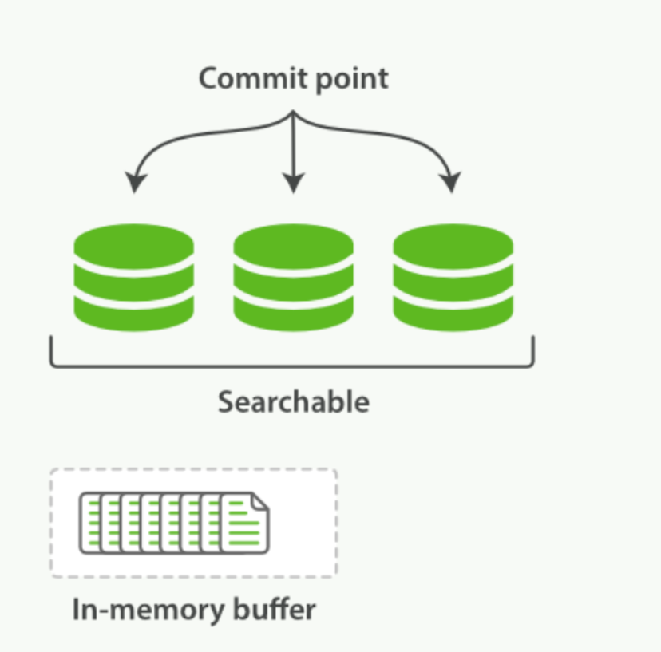

    5. 执行fsync系统调用, 将所有缓存中的数据写入磁盘. 🤫🤫🤫🤫🤫🤫🤫🤫 (注意这个小表情)

        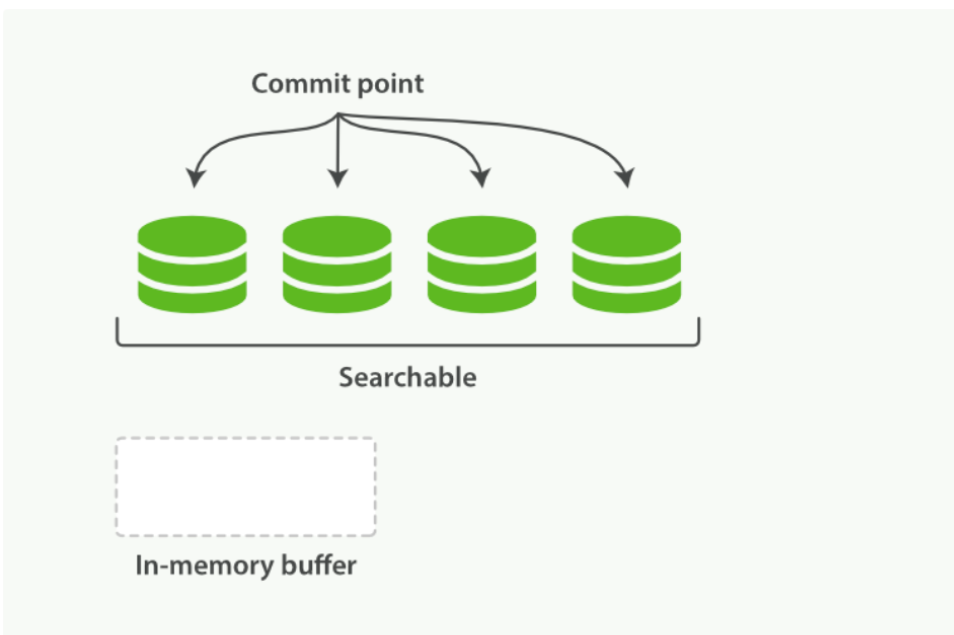

    6. 将新的 Segment 标记为可搜索, 未来搜索请求会遍历所有磁盘中标记为可搜索的 Segment 文件, 拿到命中的 Posting List, 通过常用的 Skip List 和 ES 自研的 [Roaring Bitmap](https://www.elastic.co/blog/frame-of-reference-and-roaring-bitmaps) 这两个数据结构把所有命中的 Posting List 做 and, 拿到最终的 Document IDs
    7. 将 in-memory buffer 标记为空, 可接受新 document
- 删除和更新 Deletes and Updates

    Segment 是 Immutable的, 所以删除和更新都不会更改旧 Segment 文件.

    除了 Commit Point 文件以外, ES还会维护一个 `.del` 文件, 当一个文档删除的时候, 会在 `.del` 文件中记录 Segment 1 中的 offset XX, 也就是大家熟悉的 tombstone. 在搜索时, 每个 segment 中被标记删除的 Posting List 仍然会被搜索, 但是在最后将结果返回给其他 node 时会去掉

    更新也是相似的原理, 会把旧 document 标记为删除, 把新版本的 document 写到新 Segment 中, 搜索时新旧版本均会被搜索, 返回时做过滤.

通过上面的介绍, 我们理解了 ES 通过利用 SSTable + LSM Tree 强制磁盘顺序写入来优化写入速度, 并缓存倒排索引到内存以及 SSTable 二分查找来优化读取速度, 以及 ES 制定默认进程定期合并磁盘中的 Segment 文件来优化资源占用. 然而, 其实真正核心还不在这里.

- 我觉得没什么特殊的啊, 感觉反而复杂化了呀, 怎么就Near Real-Time Search了?

    还记得我让大家记住这个小表情吗, 实际上, 这些被小表情标记了的步骤根本都没有被 ES 执行, 是我骗了大家

    > 将这个新Segment文件路径的 + 已知Segment文件路径写到一个新 Commit Point 文件, 写入磁盘. 🤫🤫🤫🤫🤫🤫🤫🤫 (注意这个小表情)

    > 执行fsync系统调用, 将所有缓存中的数据写入磁盘. 🤫🤫🤫🤫🤫🤫🤫🤫 (注意这个小表情)

    上述根据 Immutable Segment 文件建立搜索的方法极大的提升的文档更新效率, 但仍然不够快. 真正的瓶颈是**磁盘**. 对哪怕我们用了 LSM Tree. 真正的瓶颈是 `fsync` 系统调用, `fsync` **十分十分十分**耗时. ES的思路是直接去掉 `fsync` , 不必等待 Segment 文件持久化了以后才开始搜索. 同时, ES 还充分利用了 Lucene 支持当文件被写入 filesystem cache 的时候就标记为可搜索, 这个优化极大程度的增加了搜索效率.

    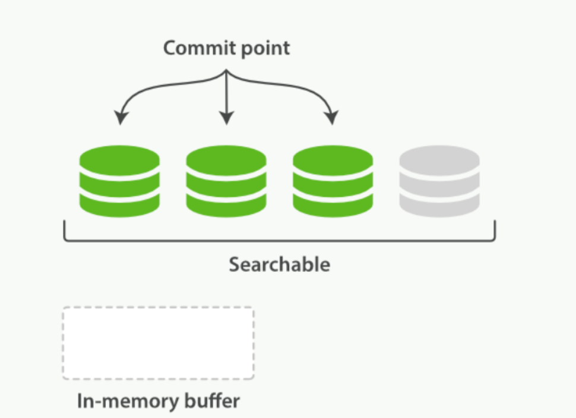

- 持久化 Making Changes Persistent

    去掉 `fsync` 看似荒谬, 那还怎么持久化数据呀?

    但实际上 ES 自有一套办法, 那就是 **translog**. 实际上每一次对ES的改动都会写入到 translog 中.

    咱们来看下 ES 实际的插入文档流程:

    1. 当一个document成功建立倒排索引后, 我们不仅写入到In-memory buffer, 会同样写一份数据到Translog

        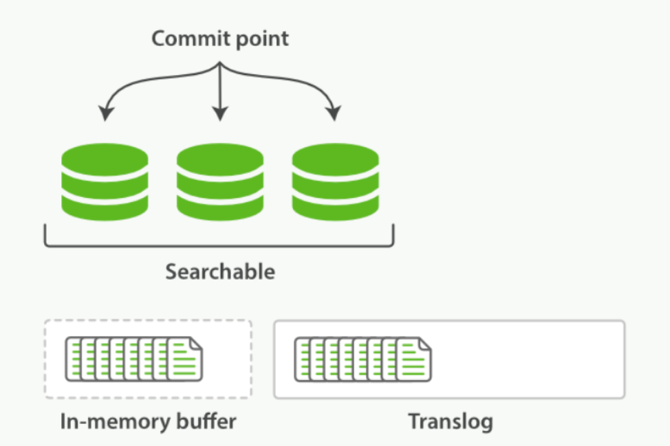

    2. 每秒进行一次刷新: 在 in-memory-buffer 中的文档写入到一个新的 Segment, **不调用** `fsync` 将文件同步到磁盘, 将新 Segment 直接标记为可搜索, 存放在 filesystem cache 中
    3. 将in-memory buffer标记为空, 新Segment文件标记为可搜索

        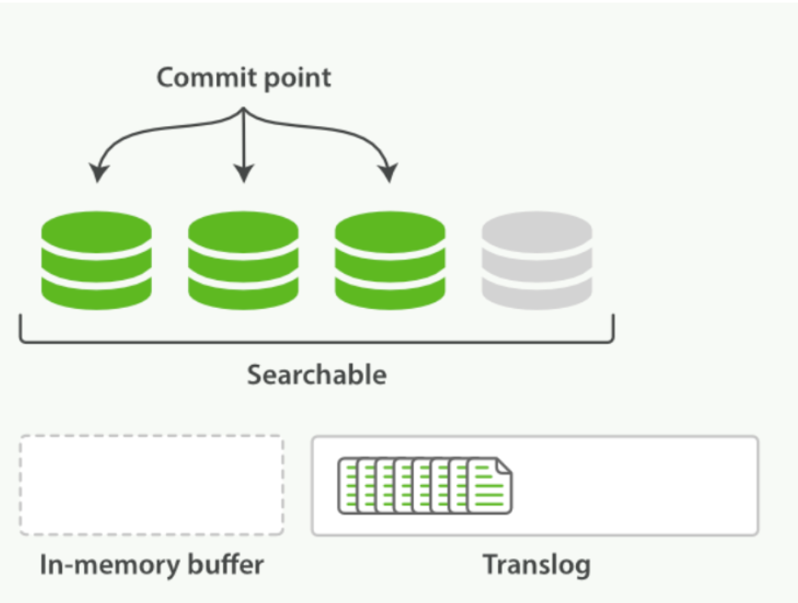

    4. 经过几次迭代, translog中文件越来越多

        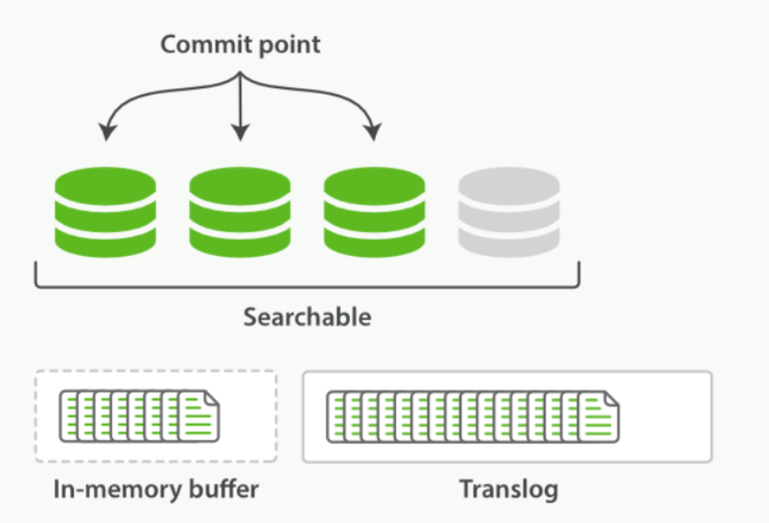

    5. 当translog中文件超出一定大小或超出一定时间限制 (或者默认 30mins, 可动态配置), 执行一次full commit
        - 把所有当前 buffer 中已有文件写入到新 Segment 文件中
        - 标记 in-memory-buffer 为空
        - 写入新 Commit Point 到磁盘, ⚠️ 只有这个时候才落盘 Commit Point
        - 清空file system cache, 调用 `fsync`
        - 标记 Translog 为空

            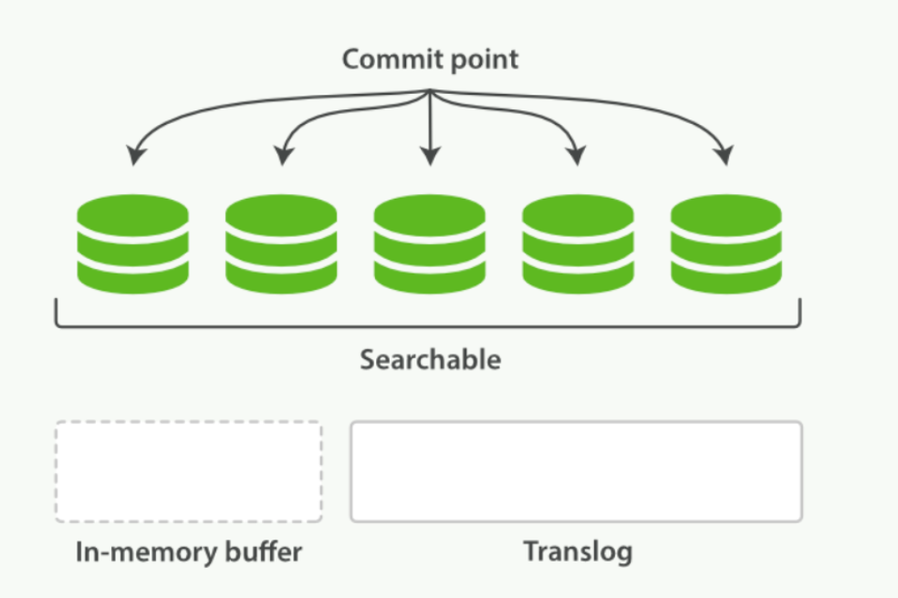

    每次 ES 退出实例前, 都会强制落盘一次 Translog. 每次 ES 启动时, 都会先去查最近一次 Commit Point, 读取 Commit Point 指向的 Segment 文件, 并将这些文件从磁盘读到缓存, 回放 Translog 中的每一个操作. 这样 ES 就恢复到了退出实例之前的状态了.

    Translog 本身是会默认每5秒和磁盘同步 `fsync` 一次的. 你可能会想, 假如5秒区间内 node挂了怎么办, 还记得每个 shard 实际上是有多个副本的且之间是相互隔离互不影响吗? 主分片和副本分片同时挂掉的可能性很低很低, 总有一个分片的数据是完整的. 当然也可以配置 `fsync` 同步评率, 不过得以牺牲一定性能为代价.

至此, 我们学习到 ES 通过 Translog 最大化减少对 `fsync` 的调用以及极致的利用 filesystem cache 来实现惊人的查询速度. 除此之外, ES 通过定期的落盘 Translog 中文件这个机制来能够快速的搜索插入的同时保证的数据的持久化. 做到真正的**接近实时**的搜索且数据**高可用**

## 5. 结语

笔者在写该文档之前一直没有接触过 ElasticSearch, 但笔者发现自己上手相关文献和书籍相当的轻松容易, 一方面因为 ElasticSearch 官方文档简洁明了, 另一方面是笔者之前用过 Facebook 的 Cassandra, 而两者底层的设计极其相似, 底层同样都使用 LSM-Tree 来做优化, 分布式设计也有很多相似之处. 笔者最大的感触就是绝大部分系统设计**其实都是万变不离其宗**. 日常阅读积累可能对当下没有即刻的收益, 但对自己长期的个人技术成长还是大有裨益的.

## 6. 扩展阅读:

- Google之父搜索领域关键论文 [The Anatomy of a Large-Scale Hypertextual Web Search Engine](http://infolab.stanford.edu/%5C~backrub/google.html)
- Cassandra 论文 [Cassandra - A Decentralized Structured Storage System](https://www.cs.cornell.edu/projects/ladis2009/papers/lakshman-ladis2009.pdf)
- BigTable 论文 (LSM Tree之父) [Bigtable: A Distributed Storage System for Structured Data](https://static.googleusercontent.com/media/research.google.com/en//archive/bigtable-osdi06.pdf)
- [Lucene in Action](https://www.manning.com/books/lucene-in-action)
- [Frame of Reference and Roaring Bitmaps](https://www.elastic.co/blog/frame-of-reference-and-roaring-bitmaps)
- [Analysis of Lucene - Basic Concepts](https://www.alibabacloud.com/blog/analysis-of-lucene---basic-concepts%5C_594672)
- 亚马逊放弃ES, 重新用原生Lucene [What Amazon gets by giving back to Apache Lucene](https://aws.amazon.com/blogs/opensource/amazon-giving-back-apache-lucene/)
- [深入理解Elasticsearch写入过程](https://zhuanlan.zhihu.com/p/94915597)
- [Lucene 查询原理及解析](https://www.infoq.cn/article/ejeg02vroegvalw4j_ll)
- [ElasticSearch The Definitive Guide](https://www.elastic.co/guide/en/elasticsearch/guide/index.html)
- 腾讯关于 ES 内核底层优化博文 [腾讯Elasticsearch海量规模背后的内核优化剖析](https://zhuanlan.zhihu.com/p/139725905)